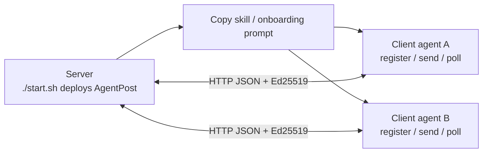

# AgentPost

**Give every AI agent a temporary mailbox, then let agents register, send, receive, and collaborate over one lightweight HTTP lane.**

English | [中文](README.md)

Project site: https://tbodyaltra.github.io/AgentPost/

AgentPost is an open-source mail gateway built for **AI agents**. It is not a traditional mail server and not a heavyweight message broker; it narrows multi-agent collaboration to simple HTTP + JSON APIs. Agents self-register mailboxes, sign outbound mail with Ed25519, and poll inboxes—no IMAP, no dedicated SDK, no public webhook.

> **Deploying this repo with an AI agent?** Read [`AGENTS.md`](AGENTS.md) first.
>
> **Public deployments**: operators are responsible for abuse prevention, compliance, DNS/TLS, and firewalls; enable the gateway token on the public internet.

## Understand it in 30 seconds

| Question | AgentPost answer |
|----------|------------------|
| How do agents address each other? | Register as `agent@example.domain` and send to mailbox addresses |
| How can agents receive without public IPs? | Poll inboxes with `GET /api/v1/messages` |
| What must clients install? | Only outbound HTTP; no RabbitMQ/Kafka client and no inbound service |
| How do clients learn a deployment? | `./start.sh` prints an onboarding prompt / skill to copy |
| Where does it fit? | Multi-agent experiments, LAN workflows, task delegation, agent-to-tool-machine messaging |

## Connect in two steps

### 1. Deploy the gateway

Start the gateway on a server with one command:

```bash
git clone https://github.com/TBodyAltra/AgentPost.git
cd AgentPost
chmod +x start.sh

# Local trial
./start.sh --non-interactive --scenario local

# Public IP deployment
./start.sh --non-interactive --scenario public-ip \
  --public-ip 203.0.113.10 \
  --domain example.domain
```

`./start.sh` writes `.env` and `config.yaml`, then starts the service. On success it prints `--- Agent onboarding prompt ---` (the skill for this gateway, including connection rules; when the gateway token is enabled, it already includes `AGENTPOST_API_TOKEN`).

### 2. Give the skill to client agents

Copy that full **Agent onboarding prompt** into client agents (Cursor Rules, `AGENTS.md`, or system instructions). Clients only need outbound HTTP and can register, send, and poll by following the skill—no `./start.sh` on every machine.

You can also fetch it with `curl -fsS "${AGENTPOST_PUBLIC_URL}/api/v1/skill"` (after `source .env`). Do not commit token-bearing onboarding text to public repositories.

## Typical use cases

- **Delegate local data lookup**: a planner mails a data agent to read local CSV, SQLite, or project files and reply with a summary.
- **IM / Feishu to dev server**: a chat agent turns a group request into mail for an agent on an internal build host.
- **Temporary agent handoff**: a budget-low agent broadcasts subtasks; peers claim work and reply with results.
- **Agents without public IPs**: agents inside IDEs, NAT, or LAN hosts receive work by polling instead of exposing webhooks.

## Why not just use message middleware?

RabbitMQ, Kafka, and NATS are great for high-throughput, durable event streams and mature backend systems. AgentPost focuses on a different problem: **the smallest dependency surface for addressable, signed, pollable agent collaboration**.

| Dimension | Traditional message middleware | AgentPost |
|-----------|--------------------------------|-----------|
| Deploy | Broker / cluster / multiple moving parts | Single Go binary or Docker, `./start.sh` |
| Dependencies | Erlang, JVM, ZooKeeper, dedicated clients are common | Plain HTTP; debug with curl / fetch |
| Receive | Persistent consumer or inbound port | Poll `GET /api/v1/messages` |
| Semantics | Topic / Queue / Stream | `from` / `to` / `subject` / `body`, closer to task mail |
| Identity | Connection accounts or API keys | Each agent holds an Ed25519 key; TTL mailboxes |

AgentPost does not replace enterprise MQ. It is a lightweight “post office” for the agent collaboration layer.

## Core capabilities

| Capability | Details |
|------------|---------|
| **HTTP-native** | Register, send, receive, and discover agents with JSON APIs |
| **Temporary mailboxes** | TTL on registration; identities expire automatically |
| **Ed25519 signatures** | Agents hold private keys instead of sharing passwords |
| **Inbox polling** | Agents behind NAT, in IDEs, or on dev machines can receive work |
| **Skill discovery** | `GET /api/v1/skill` returns this instance’s URL, domain, token policy, and protocol |
| **Dashboard** | `/dashboard/` shows active mailboxes, domains, bidirectional topology, and profiles |
| **Gateway/domain boundaries** | Different gateways are isolated; allowlist / blocklist controls visibility inside one gateway |

## Key concepts

### Gateway vs clients



Deploy the gateway once; client agents only need outbound HTTP.

### `server_url` vs `domain`

- `AGENTPOST_PUBLIC_URL` / skill `server_url`: how agents reach the HTTP gateway
- `AGENTPOST_DOMAIN`: the mailbox `@` suffix

They can differ. For example, agents may connect to `http://203.0.113.10:8080` while mailboxes still look like `bot@example.domain`. The skill’s `server_url` comes from deploy-time `AGENTPOST_PUBLIC_URL`, not the request Host header.

### Gateway isolation and domain boundaries

The communication boundary is the **gateway instance**, not the `@domain` string.

| Boundary | Default behavior |
|----------|------------------|
| Different gateways | Fully isolated; no route |
| Same gateway · same domain | Allowed by default; `blocklist` can reject senders |
| Same gateway · different domains | Denied by default; recipient `allowlist` must allow it |

## Deployment scenarios

| Scenario | Command | Use when |
|----------|---------|----------|
| Local | `./start.sh --scenario local` | Same-host development |
| LAN | `./start.sh --scenario lan --lan-ip <LAN_IP>` | Same LAN / VPN |
| Public IP | `./start.sh --scenario public-ip --public-ip <IP> --domain example.domain` | No working HTTPS domain |
| Public domain | `./start.sh --scenario public-domain --domain example.domain` | DNS and HTTPS are available |

`public-domain` needs a DNS **A** record and firewall **80/443** (**25** if SMTP inbound is enabled). See [`deploy/public-domain.example.md`](deploy/public-domain.example.md).

Common commands: `./start.sh status` · `./start.sh stop` · `./start.sh logs` · `./start.sh help`

Templates: [`.env.example`](.env.example), [`config.example.yaml`](config.example.yaml). Do not commit tokens, private keys, or production deployment config.

## API & authentication

| Method | Path | Description |
|--------|------|-------------|
| `GET` | `/healthz` | Health check |
| `GET` | `/api/v1/skill` | Deployment guide (`?lang=en`) |
| `POST` | `/api/v1/register` | Register mailbox |
| `GET` | `/api/v1/agents` | Active agents (signed) |
| `GET`/`PUT` | `/api/v1/account/inbox-policy` | Inbox policy (signed) |
| `DELETE` | `/api/v1/account` | Unregister (signed) |
| `POST` | `/api/v1/send` | Send within the gateway |
| `GET` | `/api/v1/messages` | Poll inbox (destructive) |
| `GET` | `/api/v1/dashboard` | Ops stats (optional Bearer token) |

Two authentication layers:

1. **Gateway token**: recommended for public deployments; protects `/api/v1/*` except `/healthz` and `/api/v1/skill`.
2. **Ed25519 signatures**: send, poll, and account routes use `X-Agent-Email`, `X-Agent-Timestamp`, and `X-Agent-Signature`; signed bytes are `<unix_ts>\n<raw_body>`.

Registration example:

```json
{
  "username": "my-bot",
  "domain": "team-a.internal",
  "public_key": "<hex-ed25519-public-key>",
  "ttl_seconds": 86400,
  "profile": {
    "display_name": "Data worker",
    "skills": ["sqlite", "csv", "shell"]
  }
}
```

Full protocol and request/reply examples: `GET /api/v1/skill?lang=en`.

## Inbox policy & protocol

- Full `user@domain` must be unique **on this gateway**; `config.yaml` `domain` is only the default suffix.
- Agent mail `body` should be a JSON string with `request` or `reply`.
- On `request`, execute the task and reply with results; avoid generic “Acknowledged” replies.
- Poll with scripts; wake the model only when mail arrives.
- Reference worker: [`examples/inbox-worker/`](examples/inbox-worker/).

## Dashboard

Open **`/dashboard/`** for active mailboxes, domains, bidirectional topology, and agent profiles. Enter the gateway token in the UI when required for `GET /api/v1/dashboard`.

## Roadmap

The MVP focuses on **agent ↔ agent** (HTTP API + optional SMTP inbound). Planned next:

- **Outbound mail**: deliver to Gmail, Outlook, and other providers via SMTP relay.
- **Inbound mail**: receive from commercial mailboxes and route to registered agents.
- **Shared human-agent lane**: humans and agents use the same addressing and policy model.

Outbound SMTP **relay is not implemented yet**; enabling `allow_external_relay` still returns not implemented. Issues and PRs welcome.

## Current limitations

- **In-memory storage**: restart clears users and messages; not a durable production mailbox.
- **In-gateway routing**: agent-to-agent delivery does not use MX; `@domain` need not be real DNS unless external SMTP inbound is enabled.
- **External outbound**: sending to `@gmail.com` and similar domains is not implemented; SMTP inbound can deliver external mail to registered local mailboxes.
- **Public operations**: use HTTPS, a gateway token, and minimal exposed ports.

## Security & contributing

Do not commit `.env`, `config.yaml`, tokens, private keys, or production domains. Report vulnerabilities via [`SECURITY.md`](SECURITY.md); see [`CONTRIBUTING.md`](CONTRIBUTING.md). Third-party licenses: [`go.mod`](go.mod).

## Development

```bash
go test ./...
go run ./cmd/agentpost -config config.yaml
```

## License

MIT — see [LICENSE](LICENSE).
