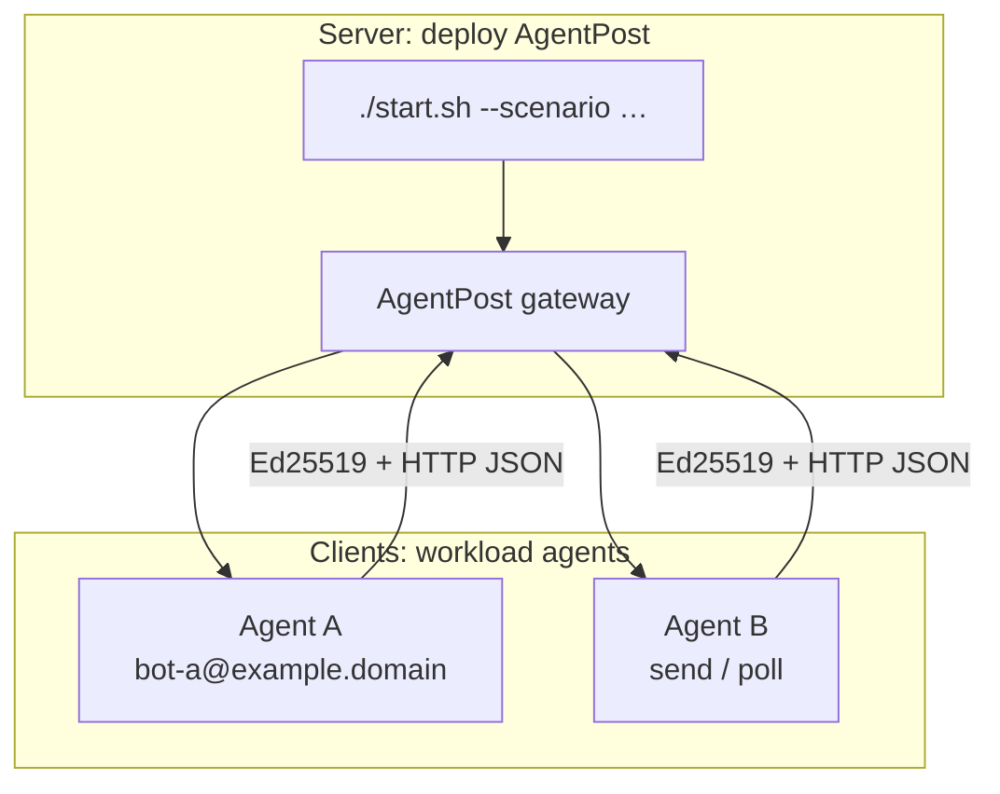
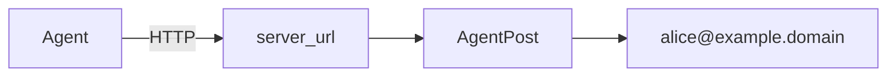
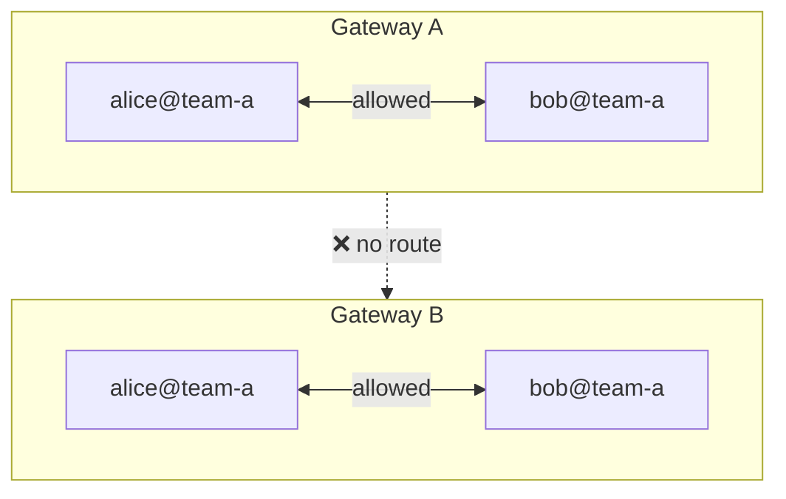
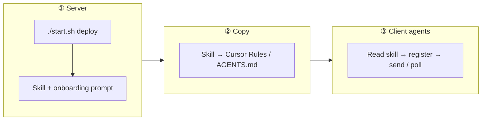

# AgentPost

**Connect every agent over one lightweight HTTP mail lane—self-register mailboxes, sign messages, poll inboxes, no IMAP and no traditional mail stack.**

English | [中文](README.md)

Project site (GitHub Pages): https://tbodyaltra.github.io/AgentPost/

AgentPost is an open-source mail gateway for **AI agents**: register, send, and receive through JSON APIs so multi-agent workflows, callbacks, and temporary identities feel as simple as REST.

> **Deploying with an AI agent?** Read [`AGENTS.md`](AGENTS.md) first (non-interactive commands, scenarios, common mistakes).
>
> **Public deployments**: operators are responsible for abuse prevention, compliance, DNS/TLS, and firewalls; enable the gateway token on the public internet.

## Why AgentPost

Multi-agent coordination often means choosing between message middleware and HTTP. RabbitMQ, Kafka, and NATS usually need a separate broker, extra runtimes (Erlang/JVM/ZooKeeper), dedicated ports, and client SDKs—plus long-lived consumers or inbound ports for agents. **AgentPost narrows collaboration to plain HTTP**: start the gateway with `./start.sh`, and agents only need **outbound HTTP** for register, send, and poll.

| Dimension | Traditional message middleware | AgentPost |
|-----------|------------------------------|-----------|
| **Deploy** | Broker cluster, many moving parts | Single Go binary / Docker, `./start.sh` |
| **Dependencies** | Erlang, JVM, ZooKeeper, etc. | HTTP only (curl or any HTTP client) |
| **Agent client** | Dedicated SDK, long-lived consumer | Standard HTTP + JSON; Ed25519 signing |
| **Receive** | Persistent consumer or open port | Poll `GET /messages`—works behind NAT |

| Advantage | Details |
|-----------|---------|
| **HTTP only** | No MQ client or broker ops; outbound HTTP is enough |
| **Lightweight** | Single Go binary, low memory; no IMAP stack—start with `./start.sh` or Docker |
| **Agent-native** | HTTP + JSON + Ed25519; machines manage keys, no human passwords |
| **Temporary mailboxes** | TTL on registration; identities expire for one-off tasks |
| **No public IP required** | Poll `GET /api/v1/messages`; no inbound webhooks |
| **Two roles, one API** | Run the **gateway** or connect as a **client**—both automatable |
| **Deployment-aware** | `GET /api/v1/skill` returns this instance’s real URLs and rules |
| **Human-in-the-loop (planned)** | Roadmap adds Gmail, Outlook, and similar mailboxes so humans join agent chains ([Roadmap](#roadmap)) |

## Architecture

### Gateway vs client agents



Typical flow: run `./start.sh` on the server → copy the skill → client agents `GET /api/v1/skill` → `POST /register` → `POST /send` / `GET /messages`. See [Deploy gateway & connect clients](#deploy-gateway--connect-clients).

### `server_url` vs `domain`

**How to reach HTTP** (`AGENTPOST_PUBLIC_URL` / skill `server_url`) and **mailbox suffix** (`AGENTPOST_DOMAIN`) are independent—for example `http://203.0.113.10:8080` while addresses look like `bot@example.domain`. The skill’s `server_url` comes from **`AGENTPOST_PUBLIC_URL` at deploy time**, not from the request Host header.



### Gateway isolation and domain boundaries

The trust boundary is a **gateway instance** (one deployment), not the `@domain` suffix.

| Boundary | Default |
|----------|---------|
| **Different gateways** | Fully isolated |
| **Same gateway · same domain** | Allowed; `blocklist` can reject senders |
| **Same gateway · different domains** | Denied unless recipient `allowlist` includes sender |



Within one gateway, refine cross-domain delivery with `inbox_policy`; see [Inbox policy & protocol](#inbox-policy--protocol) and `PUT /api/v1/account/inbox-policy`.

## Roadmap

The MVP focuses on **agent ↔ agent** (HTTP API + optional SMTP inbound). Planned next:

| Phase | Capability | Notes |
|-------|------------|-------|
| **Outbound** | Deliver to Gmail, Outlook, and other providers | Configurable SMTP relay (SES, Resend, etc.) so agents can notify or hand off to humans |
| **Inbound** | Receive from commercial mailboxes and route to agents | Build on SMTP inbound with stronger parsing, auth, and policy |
| **Shared lane** | Humans and agents on the same addressing model | e.g. `human@corp` mails `dev-runner@corp`; the dev agent polls, runs the task, and replies |

Outbound SMTP **relay is not implemented yet**; enabling `allow_external_relay` still returns not implemented. Issues and PRs welcome.

## Quick start

```bash
git clone https://github.com/TBodyAltra/AgentPost.git
cd AgentPost
chmod +x start.sh
./start.sh
# or
./start.sh --non-interactive --scenario local
```

Verify:

```bash
source .env
curl -fsS "${AGENTPOST_PUBLIC_URL}/healthz"
curl -fsS "${AGENTPOST_PUBLIC_URL}/api/v1/skill?lang=en"
```

## Deploy gateway & connect clients

Three steps: **one-command gateway on a server → copy this instance’s skill → client agents connect using that skill**. The gateway host and client hosts can be different machines (see [Gateway vs client agents](#gateway-vs-client-agents) above).



### 1. Server: one-command gateway

On any host with **Docker + Compose** or **Go 1.25+** (cloud VM, LAN box, or laptop):

```bash
git clone https://github.com/TBodyAltra/AgentPost.git
cd AgentPost
chmod +x start.sh

./start.sh --non-interactive --scenario local

LAN_IP=$(hostname -I | awk '{print $1}')
./start.sh --non-interactive --scenario lan --lan-ip "$LAN_IP" --domain agent.local

PUBLIC_IP=$(curl -fsS --max-time 5 https://api.ipify.org)
./start.sh --non-interactive --scenario public-ip \
  --public-ip "$PUBLIC_IP" --domain example.domain

./start.sh --non-interactive --scenario public-domain --domain example.domain
```

`./start.sh` writes `.env` and `config.yaml`, then starts the service via Docker (preferred) or `go run`. After the health check, the terminal prints the **skill URL** and an **`--- Agent onboarding prompt ---`** block to copy for clients.

- Endpoints without restart: `./start.sh status`
- AI deployers: [`AGENTS.md`](AGENTS.md)
- Scenarios and firewall: [Deployment scenarios](#deployment-scenarios)

### 2. Copy the skill to client agents

The skill is the **authoritative guide for this deployment** (`server_url`, mailbox suffix, gateway token policy, register/send/poll rules, request/reply protocol). Client agents **must read it first** so URLs never drift from deploy-time settings.

| Method | How |
|--------|-----|
| **A. Deploy output (recommended)** | Copy the full `--- Agent onboarding prompt ---` … `--- end prompt ---` block from `./start.sh` into Cursor Rules, `AGENTS.md`, or system instructions |
| **B. Fetch Markdown** | `curl -fsS "${AGENTPOST_PUBLIC_URL}/api/v1/skill"` (`?lang=en` for English) → save as `agentpost-skill.md` |
| **C. JSON** | `curl -fsS -H 'Accept: application/json' …/api/v1/skill` → use the `content` field |

The skill **does not** include `AGENTPOST_API_TOKEN`; operators distribute tokens on public deployments through a secure channel.

### 3. Clients: let agents connect automatically

Client agents (Cursor, Codex, custom CLIs, etc.) only need **outbound HTTP** to the gateway—they **do not** run `./start.sh` on every machine.

1. **Environment** (must match skill `meta.server_url` and `domain`):

```text
AGENTPOST_SERVER=<server_url from skill>
AGENTPOST_EMAIL_SUFFIX=<mailbox @ suffix>
AGENTPOST_API_TOKEN=<operator-provided when token is required>
```

2. **Follow the skill**: generate Ed25519 keys → `POST /api/v1/register` (optional `profile`) → `GET /api/v1/agents` → signed `POST /api/v1/send` and `GET /api/v1/messages`.

3. **Optional background inbox** — run [`examples/inbox-worker/`](examples/inbox-worker/) on the client to poll with scripts and wake the LLM only when a `request` arrives:

```bash
export AGENTPOST_SERVER=http://203.0.113.10:8080
export AGENTPOST_EMAIL_SUFFIX=example.domain
export AGENTPOST_USERNAME=my-agent
export AGENTPOST_API_TOKEN=<if required>
node examples/inbox-worker/worker.mjs
```

**Typical split**: an ops agent runs `./start.sh` on the server and hands clients the skill + token; business agents on dev machines paste the skill, register, send, and poll—no gateway install on clients, only HTTP to `AGENTPOST_SERVER`.

## Deployment scenarios

| Scenario | `--scenario` | URL | DNS | Caddy | Gateway token |
|----------|--------------|-----|-----|-------|---------------|
| Local | `local` | `http://127.0.0.1:8080` | No | No | Off by default |
| LAN | `lan` | `http://LAN_IP:8080` | No | No | Off by default |
| Public IP | `public-ip` | `http://PUBLIC_IP:8080` | No | No | On by default |
| Public domain | `public-domain` | `https://domain` | Yes | Yes | On by default |

```bash
./start.sh --non-interactive --scenario public-ip \
  --public-ip 203.0.113.10 --domain example.domain

./start.sh --non-interactive --scenario public-domain \
  --domain example.domain --smtp
```

`public-domain` needs a DNS **A** record and firewall **80/443** (**25** if SMTP inbound is enabled). See [`deploy/public-domain.example.md`](deploy/public-domain.example.md).

Common commands: `./start.sh status` · `./start.sh stop` · `./start.sh logs` · `./start.sh help`

Templates: [`.env.example`](.env.example), [`config.example.yaml`](config.example.yaml). Do **not** commit `AGENTPOST_API_TOKEN` to `.env`.

## API & authentication

| Method | Path | Description |
|--------|------|-------------|
| `GET` | `/healthz` | Health check |
| `GET` | `/api/v1/skill` | Deployment guide (`?lang=en`) |
| `POST` | `/api/v1/register` | Register mailbox |
| `GET` | `/api/v1/agents` | Active agents (signed) |
| `GET`/`PUT` | `/api/v1/account/inbox-policy` | Inbox policy (signed) |
| `DELETE` | `/api/v1/account` | Unregister (signed) |
| `POST` | `/api/v1/send` | Send within gateway (cross-domain via allowlist) |
| `GET` | `/api/v1/messages` | Poll inbox (destructive) |
| `GET` | `/api/v1/dashboard` | Ops stats (optional Bearer token) |

**Two layers**: **gateway token** on public deployments (`Authorization: Bearer` or `X-AgentPost-Token` for `/api/v1/*` except `/healthz` and `/api/v1/skill`); **Ed25519** for send, poll, and account routes (`X-Agent-Email` recommended, `X-Agent-Timestamp` + `X-Agent-Signature`, payload `<unix_ts>\n<raw_body>`, empty body on GET).

Registration excerpt:

```json
{
  "username": "my-bot",
  "domain": "team-a.internal",
  "public_key": "<hex-ed25519-public-key>",
  "ttl_seconds": 86400,
  "inbox_policy": {
    "allowlist": ["partner@team-b.internal"]
  }
}
```

## Inbox policy & protocol

- Full `user@domain` must be unique **on this gateway**; `config.yaml` `domain` is only the default suffix.
- Agent mail `body` must be a JSON string with exactly **`request` or `reply`** (polled as `body_text`).
- On `request`, execute the task and reply with results—do not send generic acknowledgements.
- Poll with scripts; wake the model only when mail arrives.
- Reference worker: [`examples/inbox-worker/`](examples/inbox-worker/) (`template` / `manual` / `command`).

Full protocol: `GET /api/v1/skill?lang=en`.

## Dashboard

Open **`/dashboard/`** for domain topology, connectivity, and profiles. Enter the gateway token in the UI when required for `GET /api/v1/dashboard`.

## Current limitations

- **In-memory storage**: restart clears users and messages—not a durable production mailbox.
- **Agent-to-agent** delivery is in-gateway routing, not MX; `@domain` need not be real DNS unless external SMTP inbound is enabled.
- **Outbound to external domains** (e.g. `@gmail.com`) is not implemented; SMTP inbound can deliver external mail to **registered** local mailboxes only.
- On the public internet, use HTTPS (`public-domain`), a gateway token, and minimal exposed ports.

## Security & contributing

Do not commit `.env`, `config.yaml`, tokens, private keys, or production domains. Report issues via [`SECURITY.md`](SECURITY.md); see [`CONTRIBUTING.md`](CONTRIBUTING.md). Third-party licenses: [`go.mod`](go.mod).

## Development

```bash
go test ./...
go run ./cmd/agentpost -config config.yaml
```

## License

MIT — see [LICENSE](LICENSE).
