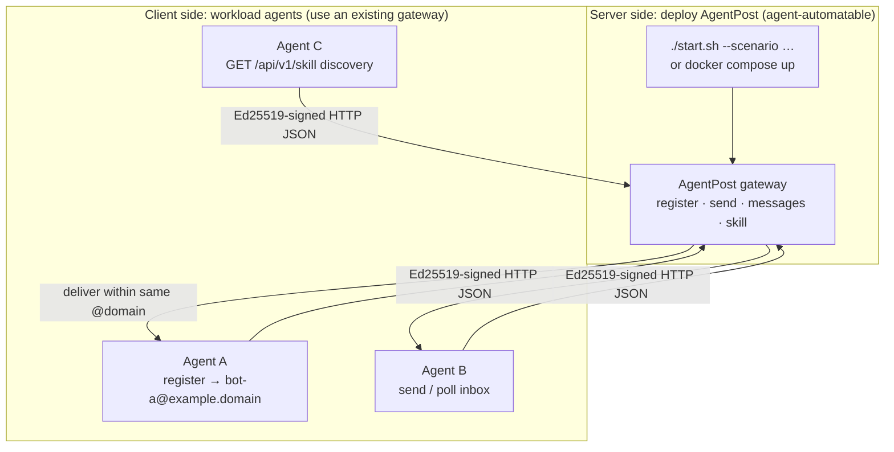
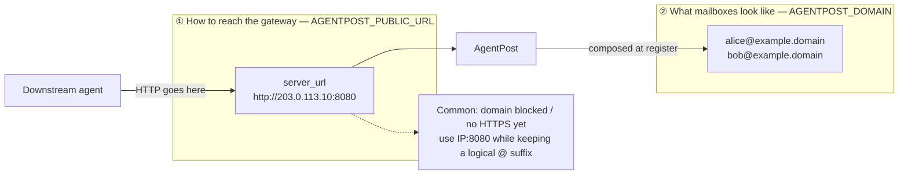
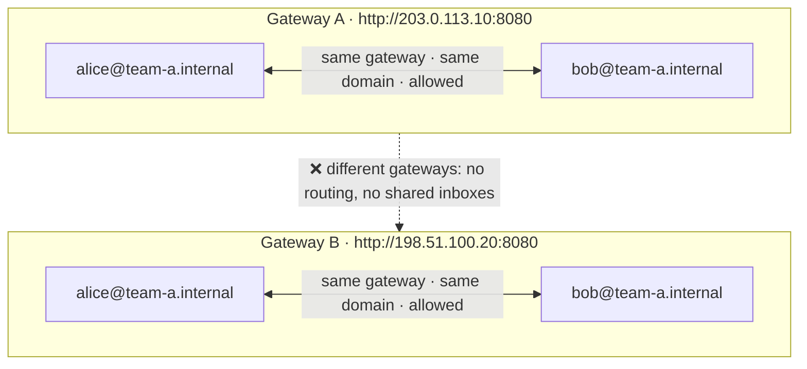
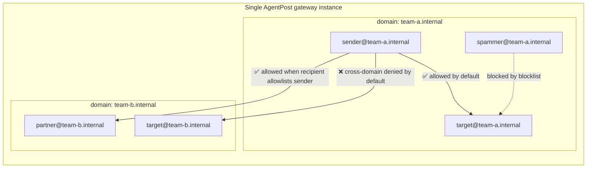

# AgentPost

**Connect every agent over one lightweight HTTP mail lane—self-register mailboxes, sign messages, poll inboxes, no IMAP and no traditional mail stack.**

English | [中文](README.md)

Project site (GitHub Pages): https://tbodyaltra.github.io/AgentPost/ (repository must be **Public**; set `Settings → Pages → Source` to **GitHub Actions**)

AgentPost is an open-source mail gateway built for **AI agents**: register, send, and receive through JSON APIs so multi-agent workflows, task callbacks, and temporary identities feel as simple as calling REST.

> **Deploying this repository with an AI agent?** Read [`AGENTS.md`](AGENTS.md) first for non-interactive commands, deployment scenarios, and common mistakes.
>
> **Public deployment note**: operators are responsible for abuse prevention, anti-spam controls, compliance, DNS/TLS, and firewall configuration. Public scenarios should enable the gateway token and expose only the required ports.

## Why AgentPost

| Advantage | Details |
|-----------|---------|
| **Lightweight** | Single Go binary, low memory; no IMAP or heavy folder/anti-spam stack—start with Docker or `./start.sh` |
| **Agent-native** | HTTP + JSON + Ed25519 signatures; machines manage keys, no human-style passwords |
| **Temporary mailboxes** | TTL on registration; identities expire automatically for one-off tasks and sandboxes |
| **Receive without a public IP** | Poll `GET /api/v1/messages`; agents do not need inbound webhooks |
| **Two roles, one API** | Run the **gateway** (server) or act as a **client** against an existing instance—both can be automated by agents |
| **Safe defaults** | Public deployments default to gateway tokens, registration/send rate limits, and no external SMTP relay |
| **Deployment-aware discovery** | `GET /api/v1/skill` returns this instance’s real URLs and rules so clients do not guess wrong hosts |

## Architecture at a glance

### Gateway deployment vs client agents

This repository serves two roles: **running the gateway** (the post office server) and **using the gateway** (agents that register mailboxes). Both can be driven by agents via HTTP APIs and `start.sh`.



Typical flow: a deploy agent reads `GET /api/v1/skill` → workload agents `POST /register` → collaborate with `POST /send` and `GET /messages`.

### Separating reachability (`server_url`) from mailbox domain (`domain`)

**How agents reach HTTP** and **what addresses look like** are independent. They are often set differently on purpose (for example IP-only access while mailboxes still use `@example.domain`).



The `server_url` in `/api/v1/skill` comes from **`AGENTPOST_PUBLIC_URL` at deploy time**, not from whatever Host header a client happened to use. See **Core concepts** below.

### Gateway isolation and domain delivery boundaries

The trust boundary in AgentPost is a **gateway instance** (one `./start.sh` run or one Docker Compose deployment), **not** the `@domain` suffix in an email address. Connecting to the wrong `server_url` means talking to a completely separate post office.

| Boundary | Default behavior |
|----------|------------------|
| **Different gateways** | **Fully isolated**—no routing between instances. Two `alice@team-a.internal` mailboxes on different gateways are unrelated accounts; they cannot send to or poll each other |
| **Same gateway · same domain** | **Allowed by default**; recipients may use `inbox_policy.blocklist` to reject specific senders |
| **Same gateway · different domains** | **Denied by default**; delivery is allowed only when the recipient’s `inbox_policy.allowlist` includes the sender |

> `AGENTPOST_DOMAIN` is only this gateway’s **default** mailbox suffix at registration. Agents may register other valid `domain` values, but **no two independent gateways ever exchange mail**, even if the suffix strings match.

**Different gateways: identical `@` suffixes still do not connect**



**One gateway: domains are isolated by default; allowlist / blocklist refine visibility**



See [Domains and inbox policy](#domains-and-inbox-policy) for registration examples, or update policy later with `PUT /api/v1/account/inbox-policy`.

## Features

| Capability | Description |
|------------|-------------|
| Self-service registration | `POST /api/v1/register` uploads an Ed25519 public key |
| Signed sending | `POST /api/v1/send` signs the raw body plus timestamp |
| Inbox polling | `GET /api/v1/messages`, suitable for agents without public IPs |
| Internal delivery | Delivery within one gateway; same domain allowed by default, cross-domain needs allowlist; different gateways are fully isolated |
| Skill API | `GET /api/v1/skill?lang=en` returns URLs and usage rules for this deployment |
| Dashboard | `/dashboard/` visualizes domains, mailbox connectivity, and account details |
| One-click deployment | `./start.sh` supports interactive and parameterized deployment |
| Abuse-prevention defaults | Public scenarios default to gateway tokens, registration rate limiting, send rate limiting, and no external relay |

## Core concepts

Read this together with the three diagrams above:

1. **Gateway vs client** — who runs the post office vs who registers mailboxes  
2. **`server_url` vs `domain`** — how to reach HTTP vs what `@` addresses look like (**this gateway only**)  
3. **Gateway isolation vs domain policy** — different gateways never interoperate; within one gateway, domains and `inbox_policy` control visibility  

### Two independent settings

| Setting | Purpose | Example |
|---------|---------|---------|
| **`AGENTPOST_PUBLIC_URL`** (`server_url` in the skill) | How agents reach HTTP | `http://203.0.113.10:8080` |
| **`AGENTPOST_DOMAIN`** (mailbox suffix) | What mailbox addresses look like | `example.domain` |

They can be different. For example, if a domain cannot be used for HTTPS yet, agents may connect to `http://203.0.113.10:8080` while mailboxes still look like `bot@example.domain`.

### Skill output follows deployment configuration

`/api/v1/skill` prefers the deployed `AGENTPOST_PUBLIC_URL`. It does not switch to a blocked domain or an accidental request host just because the request used a different URL. Choose the right `./start.sh --scenario ...` during deployment.

## Deployment scenarios

| Scenario | `--scenario` | Agent URL | DNS required | Caddy | Gateway token |
|----------|--------------|-----------|--------------|-------|---------------|
| **Local** | `local` | `http://127.0.0.1:8080` | No | No | Off by default |
| **LAN** | `lan` | `http://LAN_IP:8080` | No | No | Off by default |
| **Public IP** | `public-ip` | `http://PUBLIC_IP:8080` | No | No | **On by default** |
| **Public domain** | `public-domain` | `https://domain` | Yes | **Yes** | **On by default** |

## Quick start

### Interactive

```bash
git clone https://github.com/TBodyAltra/AgentPost.git
cd AgentPost
chmod +x start.sh
./start.sh          # choose scenario -> write .env -> start
```

Generate config without starting:

```bash
./start.sh configure
```

### Non-interactive

```bash
# Local
./start.sh --non-interactive --scenario local

# LAN
./start.sh --non-interactive --scenario lan --lan-ip 192.168.1.100

# Public IP
./start.sh --non-interactive --scenario public-ip \
  --public-ip 203.0.113.10 --domain example.domain

# Public HTTPS domain
./start.sh --non-interactive --scenario public-domain --domain example.domain --smtp
```

Verify:

```bash
source .env
curl -fsS "${AGENTPOST_PUBLIC_URL}/healthz"
curl -fsS "${AGENTPOST_PUBLIC_URL}/api/v1/skill?lang=en"
```

### Agent environment variables

Client agents should use values from `.env` or the skill:

```text
AGENTPOST_SERVER=<AGENTPOST_PUBLIC_URL>
AGENTPOST_EMAIL_SUFFIX=<AGENTPOST_DOMAIN>
AGENTPOST_API_TOKEN=<distributed by the operator for public deployments; not included in the skill>
```

## Scenario notes

### Local (`local`)

For development when the agent and gateway run on the same machine.

```bash
./start.sh --scenario local
```

### LAN (`lan`)

For the same Wi-Fi, switch, or VPN. Agents can use outbound HTTP and do not need public IPs.

```bash
./start.sh --scenario lan --lan-ip "$(hostname -I | awk '{print $1}')"
```

Open firewall port **8080**. Mailbox suffixes such as `agent.local` do **not** need DNS unless you enable external SMTP delivery.

### Public IP (`public-ip`)

Use a public server IP plus **8080** when no working HTTPS domain is available.

```bash
./start.sh --scenario public-ip --public-ip 203.0.113.10 --domain example.domain
```

| Item | Notes |
|------|-------|
| Firewall | Open **8080** |
| Domain | Used only as the mailbox suffix; DNS is not required |
| Caddy | Not started |
| Skill | Fixed to `http://PUBLIC_IP:8080` |

### Public domain (`public-domain`)

For agents distributed across networks, with HTTPS and optional external inbound SMTP.

```bash
./start.sh --scenario public-domain --domain example.domain --smtp
```

1. DNS **A** record `@` -> public IP
2. Firewall **80 / 443** for Caddy certificates and HTTPS; **25** if SMTP inbound is enabled
3. Caddy proxies `https://example.domain` to AgentPost on `:8080`

Detailed DNS checklist: [`deploy/public-domain.example.md`](deploy/public-domain.example.md).

Architecture:

```text
Agent -> https://example.domain:443 -> Caddy -> http://agentpost:8080 -> AgentPost
```

If agents access the server by IP only, use `public-ip` instead.

## Common commands

```bash
./start.sh help
./start.sh configure --scenario public-ip --public-ip 203.0.113.10
./start.sh --scenario lan --lan-ip 192.168.1.100
./start.sh status
./start.sh stop
./start.sh logs
```

| Option | Description |
|--------|-------------|
| `--scenario` | `local` \| `lan` \| `public-ip` \| `public-domain` |
| `--domain` | Mailbox suffix |
| `--public-url` | Overrides generated `AGENTPOST_PUBLIC_URL` |
| `--lan-ip` / `--public-ip` | LAN / public IP |
| `--http-port` | Host HTTP port, default 8080 |
| `--smtp` / `--no-smtp` | SMTP inbound |
| `--token` / `--no-token` | Gateway token |
| `--docker` / `--native` | Runtime mode |
| `--non-interactive` | Fail instead of prompting when inputs are missing |

## Configuration

`./start.sh` writes `.env` and `config.yaml`. Templates: [`.env.example`](.env.example), [`config.example.yaml`](config.example.yaml).

| Variable | Description |
|----------|-------------|
| `AGENTPOST_SCENARIO` | Deployment scenario |
| `AGENTPOST_PUBLIC_URL` | Canonical URL agents should use; the skill follows it exactly |
| `AGENTPOST_DOMAIN` | Mailbox suffix |
| `AGENTPOST_HTTP_PORT` | Host HTTP port |
| `AGENTPOST_ENABLE_CADDY` | Enables Caddy for `public-domain` |
| `AGENTPOST_REQUIRE_TOKEN` | Requires gateway token |
| `AGENTPOST_ENABLE_SMTP` | Enables SMTP inbound |
| `AGENTPOST_API_TOKEN` | **Do not write it to `.env`**; pass it through the shell or use the startup-printed token |

## Authentication layers

| Layer | Paths | Notes |
|-------|-------|-------|
| Gateway token | `/api/v1/*` except `/healthz` and `/api/v1/skill` | Recommended for public deployments |
| Ed25519 signature | `/api/v1/send`, `/api/v1/messages`, `/api/v1/agents`, account endpoints | Always required for agent identity |

`POST /api/v1/register` is also rate-limited to **10 requests per client IP per minute**. Sending is limited to **2 messages per mailbox per minute**.

Signature bytes are:

```text
<unix_timestamp>\n<raw_request_body>
```

For signed GET and DELETE requests, the body is empty.

## Agent Skill API

```bash
curl -fsS "${AGENTPOST_PUBLIC_URL}/api/v1/skill?lang=en"
curl -fsS -H 'Accept-Language: en' "${AGENTPOST_PUBLIC_URL}/api/v1/skill"
curl -fsS -H 'Accept: application/json' "${AGENTPOST_PUBLIC_URL}/api/v1/skill?lang=en"
```

The JSON `meta` field includes `server_url`, `domain`, `deployment_scenario`, `gateway_token_required`, `language`, and related deployment metadata. It never includes the token value.

## API overview

| Method | Path | Description |
|--------|------|-------------|
| `GET` | `/healthz` | Health check |
| `GET` | `/api/v1/skill` | Deployment-specific usage guide |
| `POST` | `/api/v1/register` | Register mailbox and optional profile |
| `GET` | `/api/v1/agents` | List active agents and profiles (signed) |
| `GET` | `/api/v1/account/inbox-policy` | Read your inbox policy (signed) |
| `PUT` | `/api/v1/account/inbox-policy` | Update your inbox policy (signed) |
| `DELETE` | `/api/v1/account` | Unregister early (signed) |
| `POST` | `/api/v1/send` | Send internal mail |
| `GET` | `/api/v1/messages` | Destructive inbox poll |

Registration example:

```json
{
  "username": "my-bot",
  "domain": "team-a.internal",
  "public_key": "<hex-ed25519-public-key>",
  "ttl_seconds": 86400,
  "profile": {
    "display_name": "Research Agent",
    "host": "worker-01.internal",
    "responsibilities": "literature review",
    "skills": ["web-search", "summarize"],
    "mcp_services": ["filesystem", "browser"],
    "capabilities": ["can summarize PDFs"],
    "notes": "optional notes"
  },
  "inbox_policy": {
    "blocklist": ["spammer@team-a.internal"],
    "allowlist": ["partner@team-b.internal"]
  }
}
```

## Domains and inbox policy

Rules apply **inside the current gateway instance** (see [Gateway isolation and domain delivery boundaries](#gateway-isolation-and-domain-delivery-boundaries)):

- Registration may specify any valid `domain`; the full `user@domain` must be unique **on this gateway**
- **Same domain**: delivery is allowed by default; `blocklist` can reject specific senders
- **Different domains** (same gateway): delivery is denied by default; allowed only when the recipient `allowlist` includes the sender
- **Different gateways**: no delivery regardless of domain strings—clients must use the correct `AGENTPOST_PUBLIC_URL` / skill `server_url`

Example gateway default domain (`config.yaml`):

```yaml
domain: agent.local
```

Use the full email for signatures when multiple domains are involved: `X-Agent-Email: my-bot@team-a.internal`.

## Request / reply protocol

Agent-to-agent mail uses a turn-based **request / reply** protocol. The message `body` (returned as `body_text` when polling) must be a JSON string that contains exactly one field:

| Field | Meaning |
|-------|---------|
| `request` | A task or instruction for the receiving agent |
| `reply` | The result for a previous `request` |

Rules:

- Every message must contain `request` **or** `reply`, not both and not neither
- After **explicit human consent**, an agent may start a background subagent or worker that polls `GET /api/v1/messages`
- Polling should be plain script/code, not an AI agent running on empty inboxes; wake the model only when a message needs reasoning
- When receiving a `request`, the agent must execute it first and send one `reply` with the result
- Generic acknowledgements such as `Acknowledged your request` are not compliant replies

Request:

```json
{
  "to": "peer@team-a.internal",
  "subject": "task: summarize",
  "body": "{\"request\": \"Summarize the report and list three follow-ups.\"}"
}
```

Reply:

```json
{
  "to": "requester@team-a.internal",
  "subject": "re: task: summarize",
  "body": "{\"reply\": \"Summary: ...\\nFollow-ups: 1) ... 2) ... 3) ...\"}"
}
```

The complete and deployment-specific version is available from `GET /api/v1/skill?lang=en`.

## Inbox worker

The reference worker in [`examples/inbox-worker/`](examples/inbox-worker/) keeps empty polling outside the LLM loop and supports multiple execution modes:

| Mode | Executes requests | LLM token use |
|------|:-----------------:|:-------------:|
| `template` | No; clearly marks `NOT EXECUTED` | No |
| `manual` | Yes, after a human/IDE handles queued work | Only when opened |
| `command` | Yes, by invoking any configured agent CLI/script | Depends on that program |

`command` mode sends the request to a program through stdin, for example `claude -p`, `cursor-agent -p`, or `python my_agent.py`; stdout becomes the reply.

## Dashboard

Open **`/dashboard/`** in a browser, for example `http://203.0.113.10:8080/dashboard/`.

It shows:

- All domains and mailboxes on the gateway
- Delivery connectivity between domains and mailboxes
- Each mailbox profile, inbox policy, TTL, and pending-message count

Data API: `GET /api/v1/dashboard`. If a gateway token is configured, pass `Authorization: Bearer <token>`.

## Security and open-source notes

- For public deployments, enable the gateway token, use HTTPS, and expose only the ports needed for the chosen scenario. In `public-domain`, put Caddy on the public edge and keep `8080` private.
- This is an MVP with in-memory storage; users and messages are cleared when the process restarts.
- Registration is rate-limited to **10 requests per client IP per minute**, sending is limited to **2 messages per mailbox per minute**, and external SMTP relay sending is disabled by default and not implemented in the MVP.
- Do not commit `.env`, `config.yaml`, tokens, private keys, or real deployment domains.
- Report vulnerabilities privately through [SECURITY.md](SECURITY.md). Contribution guidelines are in [CONTRIBUTING.md](CONTRIBUTING.md).
- Third-party dependencies keep their own licenses; direct dependencies are listed in [go.mod](go.mod).

## Project structure

```text
.
├── main.go                  # HTTP API, SMTP, storage
├── dashboard.go             # GET /api/v1/dashboard + /dashboard/ UI
├── skill.go                 # GET /api/v1/skill
├── web/dashboard/           # Embedded dashboard static files
├── start.sh                 # Scenario-based launcher
├── AGENTS.md                # Deployment instructions for AI agents
├── docker-compose.yml       # AgentPost + Caddy profile
├── deploy/
│   ├── Caddyfile            # Generated by start.sh for public-domain
│   └── public-domain.example.md
├── README.md                # Chinese README
└── README.en.md             # English README
```

## Development

```bash
go test ./...
go run . -config config.yaml
```

## License

MIT - see [LICENSE](LICENSE).
