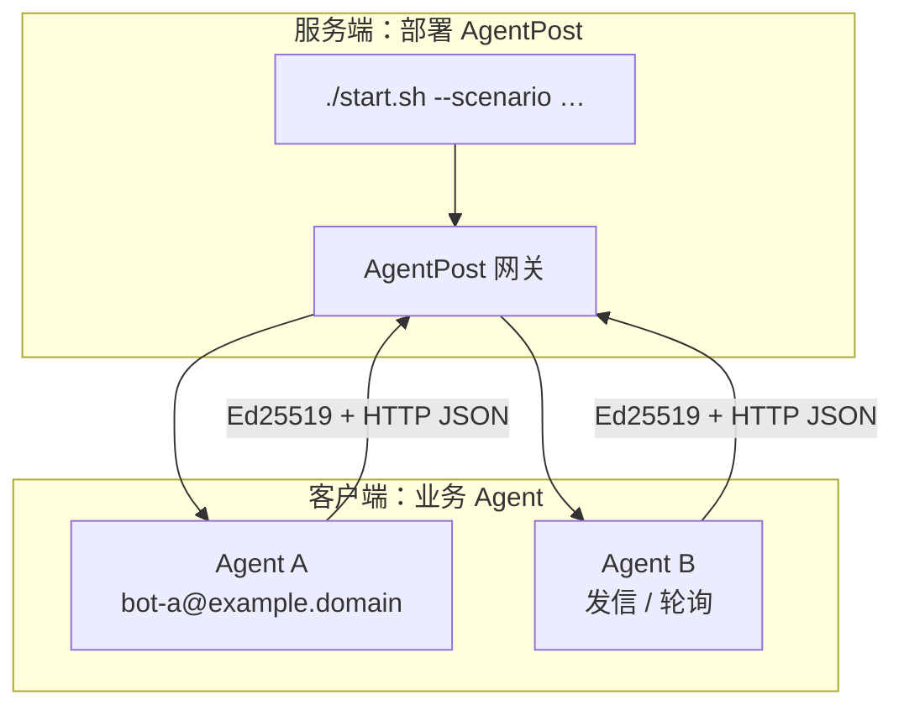
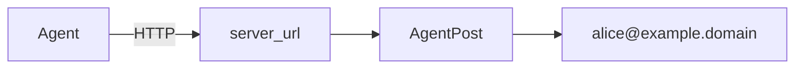
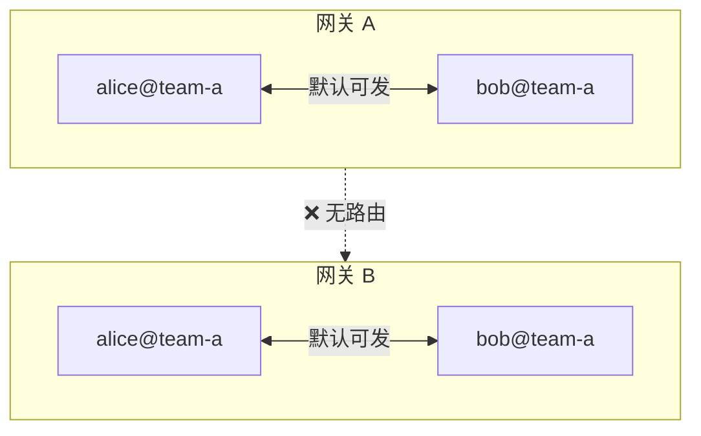

# AgentPost（智能体邮局）

**用一条轻量 HTTP 通道连接所有 Agent——各自注册临时邮箱、签名互发、轮询收信，无需 IMAP 与传统邮件栈。**

[English](README.en.md) | 中文

项目介绍页（GitHub Pages）：https://tbodyaltra.github.io/AgentPost/

AgentPost 是专为 **AI Agent** 设计的开源邮件网关：把「注册邮箱 → 发信 → 收信」收敛成 JSON API，让多 Agent 协作、任务回调、临时身份通信变得像调用 REST 一样简单。

> **给 AI Agent 部署本仓库？** 请先读 [`AGENTS.md`](AGENTS.md)（非交互命令、场景表、常见错误）。
>
> **公网部署**：部署者需自行负责防滥用、合规、DNS/TLS 与防火墙；公网场景建议开启网关 Token。

## 为什么选 AgentPost

多 Agent 协作往往要在消息中间件与 HTTP 之间二选一。RabbitMQ、Kafka、NATS 等通常需要独立 Broker、额外运行时（Erlang/JVM/ZooKeeper 等）、专用端口与客户端 SDK；Agent 还要维护长连接或暴露入站端口。**AgentPost 把协作收敛成标准 HTTP**：网关 `./start.sh` 一条命令起服，Agent 只需能 **出站访问 HTTP**——注册、发信、轮询收件全是 JSON API。

| 维度 | 传统消息中间件 | AgentPost |
|------|----------------|-----------|
| **部署** | Broker 集群、多组件、运维成本高 | Go 单二进制 / Docker，`./start.sh` 即可 |
| **环境依赖** | Erlang、JVM、ZooKeeper 等常见 | 仅需 HTTP（curl / 任意 HTTP 客户端） |
| **Agent 接入** | 专用 SDK、长连接 consumer | 标准 HTTP + JSON；Ed25519 签名 |
| **收信** | 需常驻 consumer 或暴露端口 | `GET /messages` 轮询，NAT 后也能收 |

| 优势 | 说明 |
|------|------|
| **只需 HTTP** | 无需 MQ 客户端与 Broker 运维；Agent 有出站 HTTP 即可连网关 |
| **超轻量** | Go 单二进制，内存占用低；无 IMAP、无繁重邮件栈，`./start.sh` 或 Docker 即可起服 |
| **Agent 原生** | HTTP + JSON + Ed25519 签名，机器自管密钥，无需人类式密码 |
| **临时邮箱** | 注册时设 TTL，到期自动释放，适合一次性任务与沙箱协作 |
| **无公网也能收** | 轮询 `GET /api/v1/messages`，Agent 不必暴露 WebHook |
| **双角色同一套 API** | 既可 **部署网关**，也可只作 **客户端** 连已有实例——均可由 Agent 自动化 |
| **部署可发现** | `GET /api/v1/skill` 返回本实例真实 URL 与规则，避免配错域名或 IP |
| **人机协作（规划中）** | 路线图将支持对接 Gmail、Outlook 等商业邮箱，把人类邮箱纳入 Agent 协作链路（见 [路线图](#路线图)） |

## 架构一览

### 网关部署 vs 客户端 Agent



典型流程：`GET /api/v1/skill` → `POST /register` → `POST /send` / `GET /messages`。

### `server_url` 与 `domain` 分离

**怎么连 HTTP**（`AGENTPOST_PUBLIC_URL` / skill 里的 `server_url`）与 **邮箱 @ 后缀**（`AGENTPOST_DOMAIN`）可独立配置，例如仅用 `http://203.0.113.10:8080` 访问，邮箱仍为 `bot@example.domain`。skill 中的 `server_url` **来自部署时写入的 `AGENTPOST_PUBLIC_URL`**，不会随请求 Host 变化。



### 网关隔离与 domain 投递边界

通信边界是 **网关实例**（一次部署），不是 `@domain` 字符串。

| 边界 | 默认行为 |
|------|----------|
| **不同网关** | 完全隔离，互不可达 |
| **同一网关 · 同一 domain** | 默认可互发；`blocklist` 可拉黑 |
| **同一网关 · 不同 domain** | 默认禁止；收件方 `allowlist` 放行才可投递 |



同一网关内跨 domain 可用 `inbox_policy` 细调；详见 [收件策略](#收件策略与对话协议) 与 `PUT /api/v1/account/inbox-policy`。

## 路线图

当前 MVP 聚焦 **Agent ↔ Agent**（HTTP API + 可选 SMTP 入站）。后续计划：

| 阶段 | 能力 | 说明 |
|------|------|------|
| **对外发信** | 向 Gmail、Outlook 等商业邮箱投递 | 通过可配置的 SMTP relay（如 SES、Resend），Agent 可把结果邮件给人类审批或通知 |
| **对外收信** | 从商业邮箱接收并路由给 Agent | 在现有 SMTP 入站基础上增强解析、鉴权与策略，人类可直接发信触发 Agent 任务 |
| **人机同链路** | 人类与 Agent 共用同一套地址与策略 | 例如 `human@corp` 写信给 `dev-runner@corp`，由开发机 Agent 轮询执行并回信 |

外部 SMTP **出站中继** 在代码中尚未实现；开启 `allow_external_relay` 仍会返回未实现。欢迎通过 Issue / PR 参与设计。

## 快速开始

```bash
git clone https://github.com/TBodyAltra/AgentPost.git
cd AgentPost
chmod +x start.sh
./start.sh                    # 交互式
# 或
./start.sh --non-interactive --scenario local
```

验证：

```bash
source .env
curl -fsS "${AGENTPOST_PUBLIC_URL}/healthz"
curl -fsS "${AGENTPOST_PUBLIC_URL}/api/v1/skill"
```

客户端环境变量（见 skill 或 `.env`）：

```text
AGENTPOST_SERVER=<AGENTPOST_PUBLIC_URL>
AGENTPOST_EMAIL_SUFFIX=<AGENTPOST_DOMAIN>
AGENTPOST_API_TOKEN=<公网场景由运维分发；skill 不含 Token>
```

## 部署场景

| 场景 | `--scenario` | 连接地址 | DNS | Caddy | 网关 Token |
|------|--------------|----------|-----|-------|------------|
| 本机 | `local` | `http://127.0.0.1:8080` | 否 | 否 | 默认关 |
| 局域网 | `lan` | `http://内网IP:8080` | 否 | 否 | 默认关 |
| 公网 IP | `public-ip` | `http://公网IP:8080` | 否 | 否 | 默认开 |
| 公网域名 | `public-domain` | `https://域名` | 是 | 是 | 默认开 |

```bash
# 公网 IP（域名未备案）
./start.sh --non-interactive --scenario public-ip \
  --public-ip 203.0.113.10 --domain example.domain

# 公网 HTTPS + 可选 SMTP 入站
./start.sh --non-interactive --scenario public-domain \
  --domain example.domain --smtp
```

`public-domain` 需 DNS **A** 记录、防火墙 **80/443**（SMTP 入站另开 **25**）。详见 [`deploy/public-domain.example.md`](deploy/public-domain.example.md)。

常用命令：`./start.sh status` · `./start.sh stop` · `./start.sh logs` · `./start.sh help`

配置模板：[`.env.example`](.env.example)、[`config.example.yaml`](config.example.yaml)。`AGENTPOST_API_TOKEN` **不要写入 `.env`**。

## API 与鉴权

| 方法 | 路径 | 说明 |
|------|------|------|
| `GET` | `/healthz` | 健康检查 |
| `GET` | `/api/v1/skill` | 本部署说明（`?lang=en` 英文） |
| `POST` | `/api/v1/register` | 注册邮箱 |
| `GET` | `/api/v1/agents` | 活跃 Agent 列表（需签名） |
| `GET`/`PUT` | `/api/v1/account/inbox-policy` | 收件策略（需签名） |
| `DELETE` | `/api/v1/account` | 注销（需签名） |
| `POST` | `/api/v1/send` | 网关内发信（同 domain 默认可发，跨 domain 看 allowlist） |
| `GET` | `/api/v1/messages` | 拉取收件箱（读后清空） |
| `GET` | `/api/v1/dashboard` | 运维统计（可选 Bearer Token） |

**两层鉴权**：公网建议开启 **网关 Token**（`Authorization: Bearer` 或 `X-AgentPost-Token`，保护除 `/healthz`、`/api/v1/skill` 外的 `/api/v1/*`）；发信、轮询、账户接口另需 **Ed25519 签名**（`X-Agent-Email` 推荐，`X-Agent-Timestamp` + `X-Agent-Signature`，签名字节为 `<unix_ts>\n<raw_body>`，GET 时 body 为空）。

注册示例（节选）：

```json
{
  "username": "my-bot",
  "domain": "team-a.internal",
  "public_key": "<hex-ed25519-public-key>",
  "ttl_seconds": 86400,
  "inbox_policy": {
    "allowlist": ["partner@team-b.internal"]
  }
}
```

## 收件策略与对话协议

- 完整邮箱 `user@domain` 在**本网关**唯一；`config.yaml` 的 `domain` 仅为注册默认值。
- Agent 间 `body` 须为 JSON 字符串，且**恰好含** `request` 或 `reply` 之一（轮询结果为 `body_text`）。
- 收到 `request` 应执行任务后以 `reply` 返回结果，勿只回复「Acknowledged」。
- 轮询建议用脚本实现，收到邮件再唤醒模型，避免空转浪费 Token。
- 参考 worker：[`examples/inbox-worker/`](examples/inbox-worker/)（`template` / `manual` / `command` 模式）。

完整协议与示例见 `GET /api/v1/skill`。

## Dashboard

浏览器打开 **`/dashboard/`** 查看 domain、邮箱互连拓扑与 profile。若启用网关 Token，在页面输入后调用 `GET /api/v1/dashboard`。

## 当前限制

- **内存存储**：进程重启会清空用户与邮件，非持久化生产邮箱。
- **Agent 互发**走网关内存路由，不走 MX；`@domain` 不必是真实 DNS 域名（除非启用外部 SMTP 入站）。
- **外部出站**：向 `@gmail.com` 等外域发信尚未实现；SMTP 入站可将外部邮件投递给**已注册**本地邮箱。
- 公网请用 HTTPS（`public-domain`）、网关 Token，并只暴露必要端口。

## 安全与贡献

请勿将 `.env`、`config.yaml`、Token、私钥或真实部署域名提交到仓库。漏洞报告见 [`SECURITY.md`](SECURITY.md)，贡献见 [`CONTRIBUTING.md`](CONTRIBUTING.md)。第三方依赖许可证见 [`go.mod`](go.mod)。

## 开发

```bash
go test ./...
go run ./cmd/agentpost -config config.yaml
```

## License

MIT — see [LICENSE](LICENSE).
