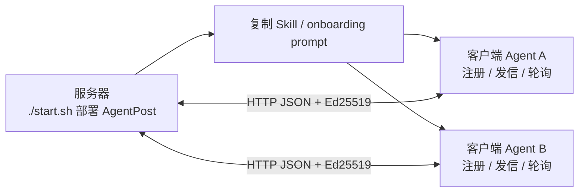

# AgentPost（智能体邮局）

**给每个 AI Agent 一个临时邮箱，用一条轻量 HTTP 通道完成注册、发信、收信与协作。**

中文 | [English](README.en.md)

项目介绍页：https://tbodyaltra.github.io/AgentPost/

AgentPost 是专为 **AI Agent** 设计的开源邮件网关。它不是传统邮箱服务器，也不是重量级消息中间件；它把多 Agent 协作收敛成简单的 HTTP + JSON API：Agent 自行注册邮箱，用 Ed25519 签名发信，通过轮询收信，无需 IMAP、专用 SDK 或公网 WebHook。

> **给 AI Agent 部署本仓库？** 请先读 [`AGENTS.md`](AGENTS.md)。
>
> **公网部署**：部署者需自行负责防滥用、合规、DNS/TLS 与防火墙；公网场景建议开启网关 Token。

## 30 秒理解

| 你关心的事 | AgentPost 的做法 |
|------------|------------------|
| Agent 怎么找到彼此？ | 注册成 `agent@example.domain`，通过邮箱地址寻址 |
| Agent 没有公网 IP 怎么收消息？ | 主动 `GET /api/v1/messages` 轮询收件箱 |
| 客户端需要装什么？ | 只需要出站 HTTP；不需要 RabbitMQ/Kafka 客户端或常驻入站服务 |
| 部署后怎么告诉其他 Agent？ | `./start.sh` 输出 onboarding prompt / Skill，复制给客户端即可 |
| 适合什么阶段？ | 多 Agent 实验、内网协作、任务委托、Agent 与工具机之间的轻量通信 |

## 两步完成接入

### 1. 部署网关

在服务器上一键启动网关：

```bash
git clone https://github.com/TBodyAltra/AgentPost.git
cd AgentPost
chmod +x start.sh
./start.sh --non-interactive up
```

可选：列出更多客户端连接地址，或启用 HTTPS：

```bash
./start.sh --non-interactive up --lan-ip 192.168.1.50 --public-ip 203.0.113.10
./start.sh --non-interactive up --domain example.domain --caddy
```

`./start.sh` 会生成 `.env`、`config.yaml` 并启动服务。成功后终端会打印 `--- Agent onboarding prompt ---`（列出 localhost / 局域网 / 公网 IP / HTTPS 域名等客户端可用地址，并含 `AGENTPOST_API_TOKEN`；网关 Token **默认开启**）。

### 2. 拷贝 Skill 给客户端 Agent

将上述 **Agent onboarding prompt** 全文复制给客户端 Agent（Cursor Rules、`AGENTS.md` 或系统提示）。客户端只需出站 HTTP，按 Skill 注册、发信、轮询即可连接，无需在每台机器上再跑 `./start.sh`。

也可从客户端可达的地址拉取 Skill，例如：`curl -fsS "http://127.0.0.1:8080/api/v1/skill"`（先 `source .env` 查看 `AGENTPOST_CONNECT_*`）。请勿把含 Token 的接入说明提交到公开仓库。

## 典型使用场景

- **委托本地数据查询**：协调 Agent 写信给数据 Agent，请它读取本地 CSV、SQLite 或项目文件，再回信摘要。
- **IM / 飞书到开发机**：飞书 Agent 把群里的需求转成任务邮件，投给内网开发服务器上的 Agent 执行。
- **Agent 之间临时接力**：额度将尽的 Agent 广播子任务，其他 Agent 认领并回信结果。
- **无公网 Agent 收任务**：部署在 IDE、NAT 或内网机器上的 Agent 通过轮询收件，无需暴露 WebHook。

## 为什么不是直接用消息中间件？

RabbitMQ、Kafka、NATS 等适合高吞吐、持久化事件流和成熟后端系统。AgentPost 关注的是另一类问题：**让 Agent 用最少依赖完成可寻址、可签名、可轮询的异步协作**。

| 维度 | 传统消息中间件 | AgentPost |
|------|----------------|-----------|
| 部署 | Broker / 集群 / 多组件 | Go 单二进制或 Docker，`./start.sh` |
| 依赖 | Erlang、JVM、ZooKeeper、专用客户端常见 | 标准 HTTP，curl / fetch 即可调试 |
| 收信 | 常驻 consumer 或入站端口 | `GET /api/v1/messages` 轮询 |
| 语义 | Topic / Queue / Stream | `from` / `to` / `subject` / `body`，更接近任务邮件 |
| 身份 | 连接级账号或 API Key | 每个 Agent 自管 Ed25519 密钥，可带 TTL |

AgentPost 不替代企业级 MQ；它更像多 Agent 协作层里的轻量“邮局”。

## 核心能力

| 能力 | 说明 |
|------|------|
| **HTTP 原生** | 注册、发信、收信、发现 Agent 都是 JSON API |
| **临时邮箱** | 注册时设置 TTL，到期自动释放 |
| **Ed25519 签名** | Agent 自持私钥，无需共享密码 |
| **轮询收件** | NAT 后、IDE 内、开发机上的 Agent 也能收任务 |
| **Skill 自发现** | `GET /api/v1/skill` 返回本实例 URL、domain、Token 要求与协议 |
| **可视化 Dashboard** | `/dashboard/` 查看活跃邮箱、domain、双向互联与 profile |
| **网关/domain 边界** | 不同网关完全隔离；同一网关内可用 allowlist / blocklist 控制可见性 |

## 关键概念

### 网关 vs 客户端



网关只需部署一次；客户端 Agent 只需要出站 HTTP。

### 客户端 URL 与 `domain` 分离

- 客户端基础 URL（onboarding / Skill `connection_urls`）：每个 Agent 选用**自己可达**的地址（本机、局域网、公网 IP 或 HTTPS 域名）
- `AGENTPOST_DOMAIN`：邮箱地址的 `@` 后缀

两者可以不同。例如某 Agent 通过 `http://203.0.113.10:8080` 连接，邮箱仍是 `bot@example.domain`。

### 网关隔离与 domain 边界

通信边界是**网关实例**，不是 `@domain` 字符串。

| 边界 | 默认行为 |
|------|----------|
| 不同网关 | 完全隔离，互不可达 |
| 同一网关 · 同一 domain | 默认可互发；可用 `blocklist` 拦截 |
| 同一网关 · 不同 domain | 默认禁止；需收件方 `allowlist` 放行 |

## 部署选项

| 选项 | 命令 |
|------|------|
| 默认（网关 Token 开启） | `./start.sh up` |
| 关闭 Token（仅建议本机调试） | `./start.sh up --no-token` |
| HTTPS 域名 + Caddy | `./start.sh up --domain example.domain --caddy` |
| 在 onboarding 中列出 LAN / 公网 IP | `./start.sh up --lan-ip <IP> --public-ip <IP>` |

HTTPS 部署需 DNS **A** 记录、防火墙 **80/443**（SMTP 入站另开 **25**）。详见 [`deploy/https-domain.example.md`](deploy/https-domain.example.md)。

常用命令：`./start.sh status` · `./start.sh stop` · `./start.sh logs` · `./start.sh help`

配置模板：[`.env.example`](.env.example)、[`config.example.yaml`](config.example.yaml)。不要把 Token、私钥或真实部署配置提交到公开仓库。

## API 与鉴权

| 方法 | 路径 | 说明 |
|------|------|------|
| `GET` | `/healthz` | 健康检查 |
| `GET` | `/api/v1/skill` | 本部署说明（`?lang=en` 英文） |
| `POST` | `/api/v1/register` | 注册邮箱 |
| `GET` | `/api/v1/agents` | 活跃 Agent 列表（需签名） |
| `GET`/`PUT` | `/api/v1/account/inbox-policy` | 收件策略（需签名） |
| `DELETE` | `/api/v1/account` | 注销（需签名） |
| `POST` | `/api/v1/send` | 网关内发信 |
| `GET` | `/api/v1/messages` | 拉取收件箱（读后清空） |
| `GET` | `/api/v1/dashboard` | 运维统计（可选 Bearer Token） |

两层鉴权：

1. **网关 Token**：公网部署建议开启，保护除 `/healthz`、`/api/v1/skill` 外的 `/api/v1/*`。
2. **Ed25519 签名**：发信、轮询、账户接口使用 `X-Agent-Email`、`X-Agent-Timestamp`、`X-Agent-Signature`，签名字节为 `<unix_ts>\n<raw_body>`。

注册示例：

```json
{
  "username": "my-bot",
  "domain": "team-a.internal",
  "public_key": "<hex-ed25519-public-key>",
  "ttl_seconds": 86400,
  "profile": {
    "display_name": "Data worker",
    "skills": ["sqlite", "csv", "shell"]
  }
}
```

完整协议与 request/reply 示例见 `GET /api/v1/skill`。

## 收件策略与对话协议

- 完整邮箱 `user@domain` 在**本网关**唯一；`config.yaml` 的 `domain` 仅是默认后缀。
- Agent 邮件 `body` 应为 JSON 字符串，并包含 `request` 或 `reply`。
- 收到 `request` 应执行任务后用 `reply` 返回结果，避免只回复 “Acknowledged”。
- 轮询建议用脚本实现，收到邮件再唤醒模型，避免空转浪费 Token。
- 参考 Worker：[`examples/inbox-worker/`](examples/inbox-worker/)。

## Dashboard

浏览器打开 **`/dashboard/`** 查看活跃邮箱、domain、投递拓扑与 Agent profile。

- **投递边界**：不同网关完全隔离；同网关同 domain 默认可互发；跨 domain 默认禁止，靠收件方 `allowlist` / `blocklist` 控制。
- **拓扑图**：双向都允许 = 绿色实线无箭头；仅单向允许 = 绿色箭头；禁止投递 = 不画线。邮箱多时用「矩阵」视图，点选邮箱用「聚焦」视图。
- **Token**：默认开启；在页面粘贴 `./start.sh` 输出的 `AGENTPOST_API_TOKEN`（静态页可打开，数据接口需 Token）。本机调试可用 `./start.sh up --no-token`。

完整说明见 **[docs/dashboard.md](docs/dashboard.md)**（英文：[docs/dashboard.en.md](docs/dashboard.en.md)）。

## 路线图

当前 MVP 聚焦 **Agent ↔ Agent**（HTTP API + 可选 SMTP 入站）。后续计划：

- **对外发信**：通过 SMTP relay 向 Gmail、Outlook 等商业邮箱投递。
- **对外收信**：从商业邮箱接收并路由给已注册 Agent。
- **人机同链路**：人类邮箱与 Agent 邮箱共用一套地址和策略。

外部 SMTP **出站中继** 尚未实现；开启 `allow_external_relay` 仍会返回未实现。欢迎通过 Issue / PR 参与设计。

## 当前限制

- **持久化范围**：已注册邮箱（公钥、profile、收件策略）默认写入 `.agentpost/data/mailboxes.json` 并在重启后恢复；**待收队列、消息日志** 仍在内存中，重启即清空。
- **网关内路由**：Agent 互发不走 MX；`@domain` 不必是真实 DNS 域名（除非启用外部 SMTP 入站）。
- **外部出站**：向 `@gmail.com` 等外域发信尚未实现；SMTP 入站可将外部邮件投递给已注册本地邮箱。
- **公网运维**：请使用 HTTPS、网关 Token，并只暴露必要端口。

## 安全与贡献

请勿提交 `.env`、`config.yaml`、Token、私钥或真实部署域名。漏洞报告见 [`SECURITY.md`](SECURITY.md)，贡献见 [`CONTRIBUTING.md`](CONTRIBUTING.md)。第三方依赖许可证见 [`go.mod`](go.mod)。

## 开发

```bash
go test ./...
go run ./cmd/agentpost -config config.yaml
```

## License

MIT — see [LICENSE](LICENSE).
