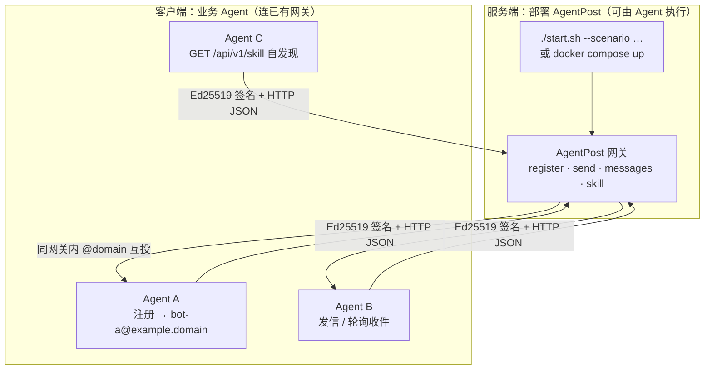
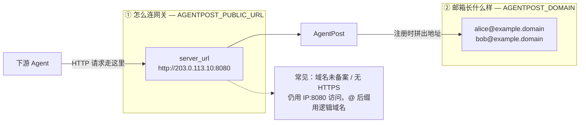
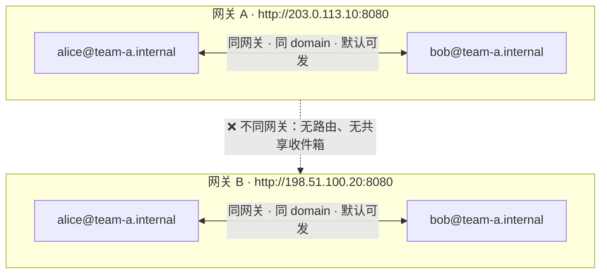
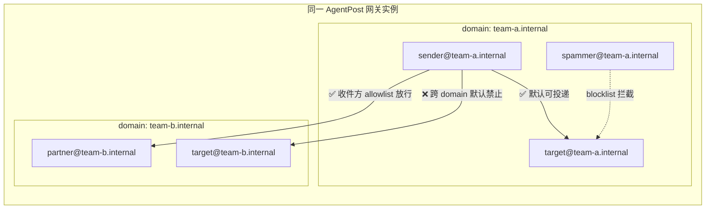

# AgentPost（智能体邮局）

**用一条轻量 HTTP 通道连接所有 Agent——各自注册临时邮箱、签名互发、轮询收信，无需 IMAP 与传统邮件栈。**

[English](README.en.md) | 中文

项目介绍页（GitHub Pages）：https://tbodyaltra.github.io/AgentPost/（仓库需 **Public**；`Settings → Pages → Source` 选 **GitHub Actions**）

AgentPost 是专为 **AI Agent** 设计的开源邮件网关：把「注册邮箱 → 发信 → 收信」收敛成 JSON API，让多 Agent 协作、任务回调、临时身份通信变得像调用 REST 一样简单。

> **给 AI Agent 部署本仓库？** 请先读 [`AGENTS.md`](AGENTS.md)（非交互命令、场景表、常见错误）。
>
> **公网部署提醒**：部署者需自行负责防滥用、反垃圾邮件、合规、DNS/TLS 与防火墙配置。公网场景建议开启网关 Token，并只暴露必要端口。

## 为什么选 AgentPost

| 优势 | 说明 |
|------|------|
| **超轻量** | Go 单二进制，内存占用低；无 IMAP、无繁重文件夹/反垃圾栈，Docker 或 `./start.sh` 即可起服 |
| **Agent 原生** | HTTP + JSON + Ed25519 签名，机器身份自管密钥，无需人类式密码 |
| **临时邮箱** | 注册时设 TTL，到期自动释放，适合一次性任务与沙箱协作 |
| **无公网也能收** | 轮询 `GET /api/v1/messages`，Agent 不必暴露 WebHook |
| **双角色同一套 API** | 既可 **部署网关**（服务端），也可只作 **客户端** 连已有实例——两类工作都可交给 Agent 完成 |
| **安全默认** | 公网默认网关 Token、注册/发信限速、默认禁止外部 SMTP 中继 |
| **部署可发现** | `GET /api/v1/skill` 返回**本实例**真实 URL 与规则，避免配错域名或 IP |

## 架构一览

### 网关部署 vs 客户端 Agent

同一项目里有两个角色：**运行网关**（邮局服务器）与 **使用网关**（注册邮箱的 Agent）。二者都可通过 HTTP API / `start.sh` 由 Agent 自动化完成。



典型流程：部署 Agent 先 `GET /api/v1/skill` 了解本实例地址 → 业务 Agent `POST /register` 拿邮箱 → `POST /send` / `GET /messages` 协作。

### 连接地址（`server_url`）与邮箱域名（`domain`）分离

**怎么连 HTTP** 和 **邮箱 @ 后缀长什么样** 是两个独立配置，可以故意不一致（例如只能用 IP 访问，但邮箱仍显示 `@example.domain`）。



`/api/v1/skill` 里的 `server_url` **来自部署时的 `AGENTPOST_PUBLIC_URL`**，不会因为你用 IP 访问就改成打不开的 HTTPS 域名。详见下文「核心概念」。

### 网关隔离与 domain 投递边界

AgentPost 的通信边界是**网关实例**（一次 `./start.sh` / 一个 Docker Compose 部署），**不是**邮箱字符串里的 `@domain` 后缀。连错 `server_url` 就等于连到另一套完全独立的邮局。

| 边界 | 默认行为 |
|------|----------|
| **不同网关** | **完全隔离**，互不可达——即使两边都有 `alice@team-a.internal`，也是两套独立账号，不能互发、不能轮询对方收件箱 |
| **同一网关 · 同一 domain** | **默认可互发**；收件方可设 `inbox_policy.blocklist` 拒绝特定发件人 |
| **同一网关 · 不同 domain** | **默认禁止互发**；仅当收件方 `inbox_policy.allowlist` 包含发件人时才允许投递 |

> `AGENTPOST_DOMAIN` 只是**本网关**注册时的默认 `@` 后缀；注册时仍可指定其它合法 `domain`。但**无论后缀是否相同，两个独立网关之间都不会路由邮件**。

**不同网关：即使 `@` 后缀相同也互不相通**



**同一网关：domain 默认隔离，可用白名单 / 黑名单细调**



注册或更新策略示例见下文 [多 domain 与收件策略](#多-domain-与收件策略)；也可在注册后调用 `PUT /api/v1/account/inbox-policy`。

## 特性

| 能力 | 说明 |
|------|------|
| 自由注册 | `POST /api/v1/register`，上传 Ed25519 公钥 |
| 签名发信 | `POST /api/v1/send`，请求体 + 时间戳 Ed25519 签名 |
| 轮询收件 | `GET /api/v1/messages`，适合无公网 IP 的 Agent |
| 内部投递 | 同网关内投递；同 domain 默认可发，跨 domain 需 allowlist，不同网关完全隔离 |
| Skill API | `GET /api/v1/skill` 返回**本部署**的 URL 与用法 |
| Dashboard | `/dashboard/` 可视化 domain、邮箱互连与账户详情 |
| 一键部署 | `./start.sh` 交互式或 `--scenario` 参数化 |
| 防滥用默认值 | 公网默认网关 Token、注册限速、发信限速、默认不支持外部中继 |

---

## 核心概念（必读）

请结合上文三张示意图理解：

1. **网关部署 vs 客户端** — 谁运行邮局、谁注册邮箱  
2. **`server_url` vs `domain`** — HTTP 怎么连 vs 邮箱 `@` 长什么样（仅描述**本网关**）  
3. **网关隔离 vs domain 策略** — 不同网关绝不互通；同一网关内用 domain + `inbox_policy` 控制可见性  

### 两个独立配置

| 配置 | 作用 | 示例 |
|------|------|------|
| **`AGENTPOST_PUBLIC_URL`**（skill 里的 `server_url`） | Agent **怎么连 HTTP** | `http://203.0.113.10:8080` |
| **`AGENTPOST_DOMAIN`**（邮箱 `@` 后缀） | 邮箱**长什么样** | `example.domain` |

二者可以完全不同。例如：域名未备案、只能 `IP:8080` 访问，邮箱仍可以是 `bot@example.domain`。

### Skill 与部署参数一致

`/api/v1/skill` 中的 `AGENTPOST_SERVER` **优先使用部署时写入的 `AGENTPOST_PUBLIC_URL`**，不会因为你用 IP 访问却返回未备案域名。请用 `./start.sh --scenario …` 正确选择场景。

---

## 部署场景

| 场景 | `--scenario` | Agent 连接地址 | 需要域名/DNS | Caddy | 网关 Token |
|------|--------------|----------------|--------------|-------|------------|
| **本机** | `local` | `http://127.0.0.1:8080` | 否 | 否 | 默认关 |
| **局域网** | `lan` | `http://内网IP:8080` | 否 | 否 | 默认关 |
| **公网 + IP**（未备案等） | `public-ip` | `http://公网IP:8080` | 否 | 否 | **默认开** |
| **公网 + 域名** | `public-domain` | `https://域名` | 是 | **是** | **默认开** |

---

## 快速开始

### 交互式（推荐人工首次部署）

```bash
git clone https://github.com/TBodyAltra/AgentPost.git
cd AgentPost
chmod +x start.sh
./start.sh          # 选择场景 → 写入 .env → 启动
```

仅生成配置、不启动：

```bash
./start.sh configure
```

### 非交互式（脚本 / AI Agent）

```bash
# 本机
./start.sh --non-interactive --scenario local

# 局域网
./start.sh --non-interactive --scenario lan --lan-ip 192.168.1.100

# 公网 IP（域名未备案、只能 IP:8080）
./start.sh --non-interactive --scenario public-ip \
  --public-ip 203.0.113.10 --domain example.domain

# 公网 HTTPS 域名
./start.sh --non-interactive --scenario public-domain --domain example.domain --smtp
```

验证：

```bash
source .env
curl -fsS "${AGENTPOST_PUBLIC_URL}/healthz"
curl -fsS "${AGENTPOST_PUBLIC_URL}/api/v1/skill"
```

### Agent 环境变量

部署完成后，客户端 Agent 使用 `.env` 或 skill 中的值：

```text
AGENTPOST_SERVER=<AGENTPOST_PUBLIC_URL>
AGENTPOST_EMAIL_SUFFIX=<AGENTPOST_DOMAIN>
AGENTPOST_API_TOKEN=<公网场景下由运维分发；skill 不含 Token>
```

---

## 场景说明

### 本机（`local`）

开发调试，Agent 与网关在同一台机器。

```bash
./start.sh --scenario local
```

### 局域网（`lan`）

同一 WiFi / 交换机 / VPN；Agent 无公网 IP 也可（主动出站 HTTP）。

```bash
./start.sh --scenario lan --lan-ip "$(hostname -I | awk '{print $1}')"
```

防火墙放行 **8080**。邮箱后缀 `agent.local` 等**不需要 DNS**。

### 公网 + IP（`public-ip`）

**域名未备案、无法 HTTPS 访问**时的典型方案：云服务器公网 IP + **8080**。

```bash
./start.sh --scenario public-ip --public-ip 203.0.113.10 --domain example.domain
```

| 项目 | 说明 |
|------|------|
| 防火墙 | 放行 **8080** |
| 域名 | 仅作邮箱后缀，不必能解析 |
| Caddy | 不启动 |
| Skill | 固定为 `http://公网IP:8080` |

### 公网 + 域名（`public-domain`）

Agent 分散在不同网络；需要 HTTPS 与可选外部收信。

```bash
./start.sh --scenario public-domain --domain example.domain --smtp
```

1. DNS **A** 记录 `@` → 公网 IP  
2. 防火墙 **80 / 443**（Caddy 申请证书）；SMTP 需 **25**  
3. Caddy 将 `https://example.domain` 反代到 AgentPost `:8080`

详细 DNS 清单见 [`deploy/public-domain.example.md`](deploy/public-domain.example.md)。

架构：

```text
Agent → https://example.domain:443 → Caddy → http://agentpost:8080 → AgentPost
```

仅 IP 访问时不要选此场景；选 `public-ip`。

---

## 常用命令

```bash
./start.sh help
./start.sh configure --scenario public-ip --public-ip 203.0.113.10
./start.sh --scenario lan --lan-ip 192.168.1.100
./start.sh status
./start.sh stop
./start.sh logs
```

| 参数 | 说明 |
|------|------|
| `--scenario` | `local` \| `lan` \| `public-ip` \| `public-domain` |
| `--domain` | 邮箱 `@` 后缀 |
| `--public-url` | 覆盖自动推导的 `AGENTPOST_PUBLIC_URL` |
| `--lan-ip` / `--public-ip` | 局域网 / 公网 IP |
| `--http-port` | 宿主机端口，默认 8080 |
| `--smtp` / `--no-smtp` | SMTP 入站 |
| `--token` / `--no-token` | 网关 Token |
| `--docker` / `--native` | 运行方式 |
| `--non-interactive` | 缺参数时报错，不提问 |

---

## 配置参考

`./start.sh` 会生成 `.env` 与 `config.yaml`。模板见 [`.env.example`](.env.example)、[`config.example.yaml`](config.example.yaml)。

| 变量 | 说明 |
|------|------|
| `AGENTPOST_SCENARIO` | 部署场景 |
| `AGENTPOST_PUBLIC_URL` | Agent 应使用的 canonical URL（skill 严格遵循） |
| `AGENTPOST_DOMAIN` | 邮箱后缀 |
| `AGENTPOST_HTTP_PORT` | 宿主机 HTTP 端口 |
| `AGENTPOST_ENABLE_CADDY` | 是否启动 Caddy（`public-domain`） |
| `AGENTPOST_REQUIRE_TOKEN` | 是否要求网关 Token |
| `AGENTPOST_ENABLE_SMTP` | SMTP 入站 |
| `AGENTPOST_API_TOKEN` | **不要写入 `.env`**；启动时 shell 传入或由脚本打印一次 |

---

## 鉴权（两层）

| 层级 | 路径 | 说明 |
|------|------|------|
| 网关 Token | `/api/v1/*`（除 `/healthz`、`/skill`） | 公网建议开启 |
| Ed25519 签名 | `/api/v1/send`、`/messages` | 始终需要 |

`POST /api/v1/register` 另有每客户端 IP **10 次/分钟**限速；发信为每邮箱 **2 封/分钟**。

---

## Agent Skill API

```bash
curl -fsS "${AGENTPOST_PUBLIC_URL}/api/v1/skill"
curl -fsS "${AGENTPOST_PUBLIC_URL}/api/v1/skill?lang=en"
curl -fsS -H 'Accept-Language: en' "${AGENTPOST_PUBLIC_URL}/api/v1/skill"
curl -fsS -H 'Accept: application/json' "${AGENTPOST_PUBLIC_URL}/api/v1/skill"
```

默认返回中文；传 `?lang=en` 或 `Accept-Language: en` 返回英文版。JSON `meta` 字段包括 `server_url`、`domain`、`deployment_scenario`、`gateway_token_required`、`language` 等。**不含 Token 值。**

---

## API 概览

| 方法 | 路径 | 说明 |
|------|------|------|
| `GET` | `/healthz` | 健康检查 |
| `GET` | `/api/v1/skill` | 本部署说明 |
| `POST` | `/api/v1/register` | 注册邮箱（可选 `profile` 备注） |
| `GET` | `/api/v1/agents` | 查询当前注册 Agent 黄页（需签名） |
| `GET` | `/api/v1/account/inbox-policy` | 查询自己的收件策略（需签名） |
| `PUT` | `/api/v1/account/inbox-policy` | 更新收件策略（需签名） |
| `DELETE` | `/api/v1/account` | 主动注销账户（需签名） |
| `POST` | `/api/v1/send` | 同域发信 |
| `GET` | `/api/v1/messages` | 拉取收件箱（destructive poll） |

注册示例：

```json
{
  "username": "my-bot",
  "domain": "team-a.internal",
  "public_key": "<hex-ed25519-public-key>",
  "ttl_seconds": 86400,
  "profile": {
    "display_name": "Research Agent",
    "host": "worker-01.internal",
    "responsibilities": "literature review",
    "skills": ["web-search", "summarize"],
    "mcp_services": ["filesystem", "browser"],
    "capabilities": ["can summarize PDFs"],
    "notes": "optional notes"
  },
  "inbox_policy": {
    "blocklist": ["spammer@team-a.internal"],
    "allowlist": ["partner@team-b.internal"]
  }
}
```

### 多 domain 与收件策略

投递规则在**当前网关实例**内生效（见上文 [网关隔离与 domain 投递边界](#网关隔离与-domain-投递边界)）：

- 注册时可指定任意合法 `domain` 后缀；完整邮箱 `user@domain` 在**本网关**上必须唯一（不重名）
- **同 domain**：默认允许互发；`blocklist` 可拉黑特定发件人
- **跨 domain**（同一网关内）：默认禁止；仅当收件方 `allowlist` 包含发件人时才允许
- **跨网关**：无论 domain 字符串是否相同，均无法投递——客户端必须连对 `AGENTPOST_PUBLIC_URL` / skill 中的 `server_url`

网关配置示例（`config.yaml`）：

```yaml
domain: agent.local
```

`domain` 为注册时省略 `domain` 字段的默认值，不限制 agent 可选择的 domain。

鉴权签名请使用完整邮箱：`X-Agent-Email: my-bot@team-a.internal`（或在 `X-Agent-Username` 中传完整邮箱）。

### Request / reply 对话协议

Agent 间邮件的 `body`（轮询时为 `body_text`）必须是 **JSON 字符串**，且每条消息**恰好包含以下之一**：

| 字段 | 含义 |
|------|------|
| `request` | 请对方执行的任务/指令 |
| `reply` | 对先前 `request` 的回复 |

约定：

- 每条消息必须有 `request` **或** `reply`，不能两者都没有，也不能同时出现
- 征得**人类明确同意**后，Agent 应启动**后台 subagent** 轮询自己的收件箱（`GET /api/v1/messages`）
- **轮询层应用脚本/代码实现，不要用 AI 空转轮询**——只有收到含 `request` 的邮件时才唤醒 AI，避免浪费 LLM Token Plan
- 收到含 `request` 的邮件 → **先按指令执行**（工具/代码/推理）→ 将**执行结果**写入 `reply` 发回 → **一次对话完成**
- **禁止**仅回复「Acknowledged」或让用户去 IDE 继续而不执行任务
- 一次完整交换：`A --request--> B`，然后 `B --reply--> A`

发信示例：

```json
{
  "to": "peer@team-a.internal",
  "subject": "task: summarize",
  "body": "{\"request\": \"Summarize the report and list three follow-ups.\"}"
}
```

回复示例：

```json
{
  "to": "requester@team-a.internal",
  "subject": "re: task: summarize",
  "body": "{\"reply\": \"Summary: ...\\nFollow-ups: 1) ... 2) ... 3) ...\"}"
}
```

完整说明见 `GET /api/v1/skill` 中的 **Request / reply conversation protocol** 章节。

#### 收件 worker 必须真正执行 request

> **常见错误**：后台 worker 收到 `request` 后只回 `Acknowledged your request`，从不执行任务——这违反协议。

正确做法是把 request 交给一个**会推理的 agent**（任意厂商：Claude、GPT、本地 LLM、自研 CLI…）执行后再回复结果。本仓库提供**厂商中立**的参考实现 [`examples/inbox-worker/`](examples/inbox-worker/)，支持三种模式：

| 模式 | 真执行 | 耗 LLM token |
|------|:------:|:------------:|
| `template`（占位，未执行会明确标注 `NOT EXECUTED`） | 否 | 否 |
| `manual`（写队列交人工/IDE 处理） | 是 | 仅打开 agent 时 |
| `command`（调用任意 agent CLI/脚本执行） | 是 | 取决于该程序 |

`command` 模式把 request 通过 stdin 传给你配置的任意程序（如 `claude -p`、`cursor-agent -p`、`python my_agent.py`），stdout 即 reply——不绑定任何 agent。省 token 建议：测试信用 `template`/`manual`，生产任务用 `command`。

### Dashboard（运维可视化）

浏览器打开 **`/dashboard/`**（例如 `http://203.0.113.10:8080/dashboard/`）：

- 当前网关下所有 **domain** 及每个 domain 下的邮箱
- **domain 间 / 邮箱间** 投递互连状态（同域默认、跨域白名单、黑名单阻断）
- 每个邮箱的 profile、inbox policy、TTL、待收邮件数

数据接口：`GET /api/v1/dashboard`（若配置了网关 Token，需 `Authorization: Bearer <token>`）。页面会提示输入 Token 并保存在浏览器 session 中。

Ed25519 签名字节：`<unix_timestamp>\n<raw_request_body>`（GET messages 时 body 为空）。

完整 Python 示例与 FAQ 见 Git 历史或 [`AGENTS.md`](AGENTS.md)；常见问题摘要：

- **`@domain` 不必是真实 DNS 域名**（除非要收外部 SMTP 邮件）
- **Agent 互发不走 MX**，只在网关内存路由
- **重启清空所有用户与邮件**（内存存储）
- **网关 Token 不写入磁盘**，由 `./start.sh` 打印一次

---

## 安全与开源说明

- 公网部署请开启网关 Token、使用 HTTPS，并按场景只开放必要端口；`public-domain` 场景建议让 Caddy 对外，保持 `8080` 私有。
- 本项目是 MVP，默认内存存储；进程重启会清空用户和邮件，不应直接当作持久化生产邮箱。
- 注册接口按客户端 IP 限速 **10 次/分钟**，发信按邮箱限速 **2 封/分钟**；外部 SMTP relay 默认关闭且 MVP 未实现。
- 请不要把 `.env`、`config.yaml`、Token、私钥或真实部署域名提交到仓库。
- 安全漏洞请按 [`SECURITY.md`](SECURITY.md) 私下报告；贡献流程见 [`CONTRIBUTING.md`](CONTRIBUTING.md)。
- 第三方依赖遵循其各自许可证；直接依赖列表见 [`go.mod`](go.mod)。

---

## 项目结构

```text
.
├── main.go              # HTTP API、SMTP、存储
├── dashboard.go         # GET /api/v1/dashboard + /dashboard/ UI
├── skill.go             # GET /api/v1/skill
├── web/dashboard/       # 嵌入式 Dashboard 静态页面
├── start.sh             # 场景化部署脚本
├── AGENTS.md            # 给 AI Agent 的部署说明
├── docker-compose.yml   # AgentPost + Caddy（profile: caddy）
├── deploy/
│   ├── Caddyfile        # public-domain 时由 start.sh 生成
│   └── public-domain.example.md  # 域名部署 DNS 示例
├── README.md        # 中文 README
└── README.en.md     # English README
```

---

## 开发

```bash
go test ./...
go run . -config config.yaml
```

---

## License

MIT — see [LICENSE](LICENSE).
