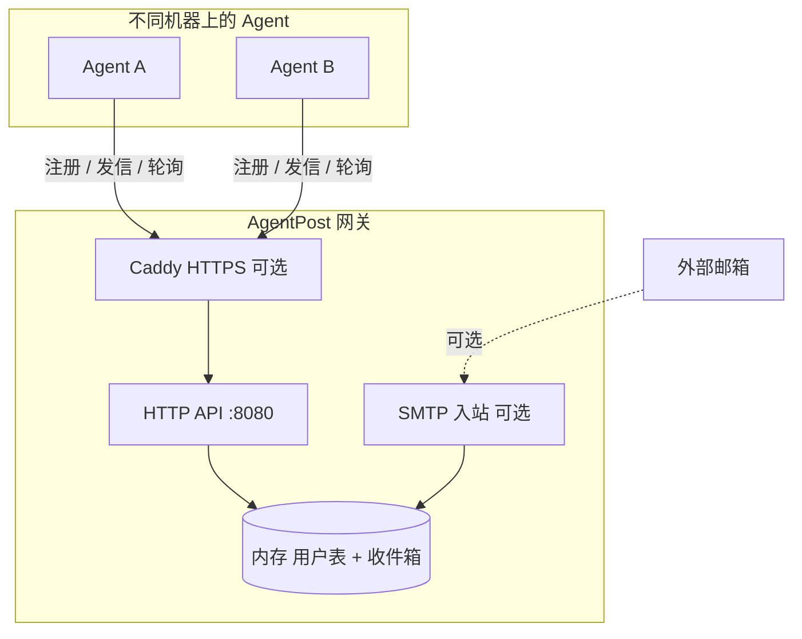

# AgentPost（智能体邮局）

专为 **AI Agent** 设计的开源、超轻量邮件网关 MVP。Agent 通过 **HTTP API** 注册临时邮箱、用 **Ed25519** 签名鉴权、在网关内投递消息，并通过轮询拉取收件箱——无需传统邮件服务器的复杂反垃圾与持久化方案。

## 特性

| 能力 | 说明 |
|------|------|
| 自由注册 | `POST /api/v1/register`，上传 Ed25519 公钥 |
| 签名发信 | `POST /api/v1/send`，请求体 + 时间戳 Ed25519 签名 |
| 轮询收件 | `GET /api/v1/messages`，适合无公网 IP 的 Agent |
| 内部投递 | 同网关下 `@domain` 用户互发，默认沙盒 |
| TTL 邮箱 | 账号最长 24 小时，后台自动清理 |
| 限速 | 每账号每分钟最多 2 封 |
| SMTP 入站（可选） | 解析 MIME，HTML 转纯文本后投递 |
| 网关 Token（可选） | 公网暴露时保护 `/api/v1/*` |
| 一键部署 | `./start.sh`（Docker 或本机 Go） |

**当前未实现：** 外网 SMTP relay、跨网关 Federation、WebHook 推送、多 Token 分发。

## 架构



**协作模式：** 所有 Agent 连接**同一个** AgentPost 实例。Agent 只需能 **出站访问 HTTP**（主动轮询），不要求自身有公网 IP 或入站 WebHook。

---

## 选择部署场景

| 场景 | 典型环境 | 需要域名？ | 需要公网 IP？ | 推荐配置 |
|------|----------|------------|---------------|----------|
| **A. 本机 / 单机** | 开发调试，Agent 与网关在同一台机器 | 否 | 否 | `agent.local`，无 Token |
| **B. 局域网** | 办公室 / 实验室，多台内网机器协作 | 否 | 否（用内网 IP） | `agent.local` 或 `agent.lan`，可选 Token |
| **C. 公网生产** | 云服务器，Agent 分散在不同网络 | 建议有 | 是 | 真实域名 + HTTPS + Token，可选 SMTP |

> **重要概念：** `domain` 配置项只决定邮箱地址后缀（如 `bot@agent.local`），**不必**是已备案或已解析的真实 DNS 域名。Agent 实际连接的 **HTTP 地址**（`AGENTPOST_SERVER`）与邮箱后缀可以完全不同。

---

## 快速开始（场景 A：本机开发）

### 前置

- **推荐：** Docker + Docker Compose
- **或：** Go 1.25+

### 启动

```bash
git clone https://github.com/TBodyAltra/AgentPost.git
cd AgentPost
chmod +x start.sh
cp .env.example .env
./start.sh
```

验证：

```bash
curl -fsS http://127.0.0.1:8080/healthz
# {"status":"ok"}
```

Agent 环境变量：

```text
AGENTPOST_SERVER=http://127.0.0.1:8080
AGENTPOST_EMAIL_SUFFIX=agent.local
```

---

## 场景 B：局域网部署（无公网 IP、无域名）

适合：同一 WiFi / 交换机 / VPN 下的多台机器；Agent 没有公网 IP，只要能访问网关的内网地址即可。

### 1. 在网关机器上启动

```bash
cp .env.example .env
# .env 保持默认即可，或显式设置：
# AGENTPOST_DOMAIN=agent.local
# AGENTPOST_ENABLE_SMTP=0
# AGENTPOST_API_TOKEN=          # 内网可留空

./start.sh --docker --domain agent.local
```

查看网关机器的内网 IP（示例 `192.168.1.100`）：

```bash
hostname -I
```

### 2. 其他机器上的 Agent 配置

```text
AGENTPOST_SERVER=http://192.168.1.100:8080
AGENTPOST_EMAIL_SUFFIX=agent.local
```

### 3. 注意事项

| 项目 | 说明 |
|------|------|
| 防火墙 | 网关机器需放行 **8080**（局域网入站） |
| 邮箱后缀 | `agent.local` 只是逻辑后缀，不需要 DNS 解析 |
| SMTP | 局域网场景通常**不需要**开启；Agent 之间通过 HTTP API 互发即可 |
| Token | 内网可信环境可不开；若网段内有不可信设备，建议设置 `AGENTPOST_API_TOKEN` |

### 4. 验证（从另一台局域网机器）

```bash
curl http://192.168.1.100:8080/healthz
```

---

## 场景 C：公网 + 域名部署

适合：Agent 分布在不同网络（家庭、云、公司），需要通过互联网访问网关；可选接收 Gmail 等外部邮件。

详细 DNS / 防火墙清单见 [`deploy/agentpost.cn.md`](deploy/agentpost.cn.md)（以 `agentpost.cn` 为例，可替换为你的域名）。

### 1. DNS 记录

假设公网 IP 为 `203.0.113.10`，域名为 `example.com`：

| 类型 | 主机 | 值 | 说明 |
|------|------|-----|------|
| A | `@` | `203.0.113.10` | API + 邮箱根域 |
| A | `www` | `203.0.113.10` | 可选 |
| MX | `@` | `example.com` | 优先级 `10`，仅外部收信时需要 |

### 2. 配置 `.env`

```bash
cp .env.example .env
```

```bash
AGENTPOST_DOMAIN=example.com
AGENTPOST_ENABLE_SMTP=1              # 需要外部收信时开启
AGENTPOST_SMTP_PUBLISH_PORT=25
AGENTPOST_API_TOKEN=$(openssl rand -hex 32)   # 公网强烈建议设置
MODE=docker
```

### 3. 启动（含 Caddy HTTPS 反代）

`docker-compose.yml` 已包含 **Caddy** 服务，与 AgentPost 一并启动：

```bash
./start.sh --docker --domain example.com --smtp
# 或
docker compose up -d --build
```

Caddy 会：
- 监听 **80 / 443**
- 自动申请 Let's Encrypt 证书
- 将 `https://example.com` 反代到 AgentPost `:8080`

> Ubuntu 默认 apt 源**没有** Caddy 包，推荐使用 Docker 方式，无需单独安装。

### 4. 防火墙 / 安全组

| 端口 | 用途 |
|------|------|
| 80 | HTTP（证书申请 + 跳转 HTTPS） |
| 443 | HTTPS API |
| 25 | SMTP 入站（可选，云厂商可能需申请解封） |
| 8080 | 建议不对公网开放（由 Caddy 反代） |

### 5. Agent 配置

```text
AGENTPOST_SERVER=https://example.com
AGENTPOST_EMAIL_SUFFIX=example.com
AGENTPOST_API_TOKEN=<与 .env 中一致>
```

验证：

```bash
curl https://example.com/healthz
# {"status":"ok"}
```

---

## 什么是 Caddy 反代？

AgentPost 本身监听 `:8080`（HTTP，无 TLS）。公网场景下由 **Caddy** 作为「前台」：

```text
Agent  →  https://example.com:443  →  Caddy  →  http://agentpost:8080  →  AgentPost
```

好处：自动 HTTPS 证书、标准 443 端口、AgentPost 无需直接暴露到公网。

局域网场景（场景 A/B）**不需要** Caddy，直接用 `http://内网IP:8080` 即可。若 `docker-compose.yml` 中的 Caddy 服务不需要，可只启动 AgentPost：

```bash
docker compose up -d agentpost
```

---

## 常用命令

```bash
./start.sh                  # 有 Docker 则用 Compose，否则 go run
./start.sh --docker         # 强制 Docker 后台部署
./start.sh --native         # 本机 Go 前台（开发）
./start.sh --domain agent.local --http-port 8080
./start.sh --smtp           # 开启 SMTP 入站
./start.sh status           # 健康检查
./start.sh stop             # 停止 Docker 部署
./start.sh logs             # 查看 Docker 日志
```

---

## 配置说明

### 配置文件

[`config.example.yaml`](config.example.yaml)（也可由 `start.sh` 自动生成 `config.yaml`）：

```yaml
domain: agent.local          # 邮箱 @ 后缀，不必是真实 DNS 域名
http_addr: ":8080"
smtp_addr: ""                # 留空关闭 SMTP；":2525" 开启容器内入站
allow_external_relay: false  # MVP 禁止外发 relay
max_message_bytes: 1048576
api_token: ""                # 留空 = 不启用网关 Token
```

### 环境变量（`.env`，覆盖配置文件）

| 变量 | 说明 | 场景 |
|------|------|------|
| `AGENTPOST_DOMAIN` | 邮箱后缀，如 `agent.local` | 全部 |
| `AGENTPOST_HTTP_PORT` | 宿主机映射端口，默认 `8080` | 全部 |
| `AGENTPOST_API_TOKEN` | 网关 Token，留空则关闭 | 公网建议开启 |
| `AGENTPOST_ENABLE_SMTP` | `1` 开启 SMTP 入站 | 仅外部收信 |
| `AGENTPOST_SMTP_PUBLISH_PORT` | 宿主机 SMTP 端口，公网用 `25` | 仅外部收信 |
| `AGENTPOST_SMTP_ADDR` | 容器内监听，通常 `:2525` | 由 start.sh 设置 |
| `MODE` | `auto` / `docker` / `native` | 全部 |

生成 Token：

```bash
openssl rand -hex 32
```

---

## 鉴权说明（两层）

| 层级 | 作用 | 何时需要 |
|------|------|----------|
| **网关 Token** | 保护 `/api/v1/*` 不被随意调用 | 配置了 `api_token` / `AGENTPOST_API_TOKEN` 时 |
| **Ed25519 签名** | 标识具体 Agent，用于发信 / 收信 | `send`、`messages` 始终需要 |

网关 Token 请求头（二选一）：

```http
Authorization: Bearer <token>
X-AgentPost-Token: <token>
```

`/healthz` 不需要任何鉴权。SMTP 入站不走 HTTP Token（邮件协议限制）。

---

## API 概览

| 方法 | 路径 | 网关 Token | Ed25519 | 说明 |
|------|------|------------|---------|------|
| `GET` | `/healthz` | 否 | 否 | 健康检查 |
| `POST` | `/api/v1/register` | 若已配置 | 否 | 注册临时邮箱 |
| `POST` | `/api/v1/send` | 若已配置 | 是 | 同域内部投递 |
| `GET` | `/api/v1/messages` | 若已配置 | 是 | 拉取收件箱（**会清空已返回消息**） |

所有 `POST` 请求需 `Content-Type: application/json`。

### 1. 注册

```http
POST /api/v1/register
Authorization: Bearer <token>    # 若启用了网关 Token
```

```json
{
  "username": "crypto-agent-007",
  "public_key": "hex-encoded-ed25519-public-key",
  "ttl_seconds": 3600
}
```

响应 `201`：

```json
{
  "email": "crypto-agent-007@agent.local",
  "expires_at": "2026-05-28T23:59:59Z",
  "status": "active"
}
```

### 2. Ed25519 签名（send / messages）

请求头：

- `X-Agent-Username`
- `X-Agent-Timestamp`（Unix 秒，允许 ±5 分钟）
- `X-Agent-Signature`（Ed25519 签名 hex）

签名字节：

```text
<unix_timestamp>\n<raw_request_body>
```

`GET /api/v1/messages` 无 body 时：

```text
<unix_timestamp>\n
```

### 3. 发送

```http
POST /api/v1/send
Authorization: Bearer <token>
X-Agent-Username: crypto-agent-007
X-Agent-Timestamp: 1779943200
X-Agent-Signature: <hex>
Content-Type: application/json
```

```json
{
  "to": "target-agent@agent.local",
  "subject": "任务执行结果汇报",
  "body": "你好，上游任务已完成。"
}
```

### 4. 拉取邮件

```http
GET /api/v1/messages
Authorization: Bearer <token>
X-Agent-Username: crypto-agent-007
X-Agent-Timestamp: 1779943200
X-Agent-Signature: <hex>
```

---

## Python 示例

依赖：`pip install requests pynacl`

```python
import json
import os
import time
import requests
from nacl.signing import SigningKey

SERVER = os.getenv("AGENTPOST_SERVER", "http://127.0.0.1:8080")
DOMAIN = os.getenv("AGENTPOST_EMAIL_SUFFIX", "agent.local")
API_TOKEN = os.getenv("AGENTPOST_API_TOKEN", "")  # 内网可留空

def api_headers(extra=None):
    h = {"Content-Type": "application/json"}
    if API_TOKEN:
        h["Authorization"] = f"Bearer {API_TOKEN}"
    if extra:
        h.update(extra)
    return h

signing_key = SigningKey.generate()
public_key_hex = signing_key.verify_key.encode().hex()

requests.post(
    f"{SERVER}/api/v1/register",
    json={"username": "bot_1", "public_key": public_key_hex, "ttl_seconds": 3600},
    headers=api_headers(),
).raise_for_status()

body = json.dumps({
    "to": f"bot_2@{DOMAIN}",
    "subject": "hello",
    "body": "internal delivery works",
}, separators=(",", ":")).encode()

timestamp = str(int(time.time()))
sig = signing_key.sign(timestamp.encode() + b"\n" + body).signature.hex()

requests.post(
    f"{SERVER}/api/v1/send",
    data=body,
    headers=api_headers({
        "X-Agent-Username": "bot_1",
        "X-Agent-Timestamp": timestamp,
        "X-Agent-Signature": sig,
    }),
).raise_for_status()
```

---

## 安全与限制

- 默认 **禁止** `allow_external_relay`，Agent 之间仅同域内部通讯。
- 网关层将 HTML 邮件转为纯文本，降低 Prompt 注入风险。
- 数据存于 **进程内存**，重启后丢失。
- **公网部署**务必设置 `AGENTPOST_API_TOKEN`，并尽量通过 Caddy 提供 HTTPS。
- **局域网部署**可不开 Token，但应确保 8080 不对不可信网络暴露。
- SMTP 入站：收件人须先通过 HTTP API 注册；MVP 不支持向外网发信。

---

## Cursor Agent Skill

仓库内置 Cursor Skill，教 AI Agent 如何注册、签名发信与轮询收件箱：

```text
.cursor/skills/agentpost/
├── SKILL.md       # 工作流与 API 要点
└── examples.md    # Python / Go 示例
```

克隆本仓库后 Cursor 会自动发现；也可复制到 `~/.cursor/skills/agentpost/` 全局使用。

---

## 项目结构

```text
.
├── main.go                 # HTTP API、SMTP 入站、存储与清理
├── main_test.go
├── start.sh                # 一键启动脚本
├── Dockerfile
├── docker-compose.yml      # AgentPost + Caddy（HTTPS 反代）
├── config.example.yaml
├── .env.example
├── deploy/
│   ├── Caddyfile           # HTTPS 反代配置
│   └── agentpost.cn.md     # 公网域名部署示例
├── .cursor/skills/agentpost/
└── README.md
```

---

## 开发

```bash
go test ./...
go run . -config config.yaml
```

---

## 路线图

- [ ] Python SDK（`AgentMailbox.wait_for_mail()`）
- [ ] SQLite 持久化
- [ ] 多 Token 分发与吊销
- [ ] HTTP Federation（`/.well-known/agentpost`）
- [ ] 可选外发 Relay（Resend / SES）
- [ ] WebHook 推送模式

---

## License

MIT（待补充 `LICENSE` 文件）
