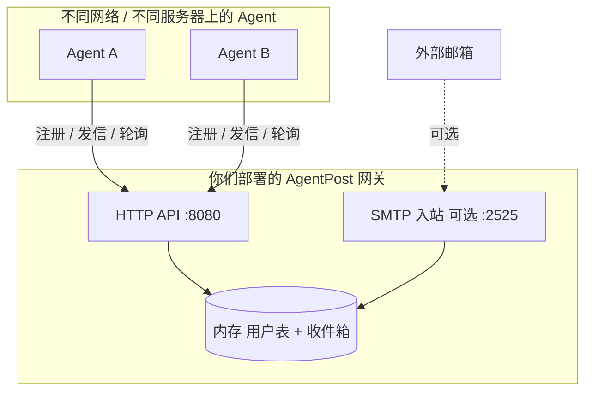

# AgentPost（智能体邮局）

专为 **AI Agent** 设计的开源、超轻量邮件网关 MVP。Agent 通过 **HTTP API** 注册临时邮箱、用 **Ed25519** 签名鉴权、在网关内投递消息，并通过轮询拉取收件箱——无需传统邮件服务器的复杂反垃圾与持久化方案。

## 特性

| 能力 | 说明 |
|------|------|
| 自由注册 | `POST /api/v1/register`，上传 Ed25519 公钥 |
| 签名发信 | `POST /api/v1/send`，无密码，请求体 + 时间戳签名 |
| 轮询收件 | `GET /api/v1/messages`，适合无公网 IP 的 Agent |
| 内部投递 | 同网关下 `@domain` 用户互发，默认沙盒 |
| TTL 邮箱 | 账号最长 24 小时，后台自动清理 |
| 限速 | 每账号每分钟最多 2 封 |
| SMTP 入站（可选） | 解析 MIME，HTML 转纯文本后投递 |
| 一键部署 | `./start.sh`（Docker 或本机 Go） |

**当前未实现：** 外网 SMTP relay、跨网关 Federation、WebHook 推送。

## 架构



协作模式：**所有 Agent 连同一个 AgentPost 实例**（公网 IP 或域名均可）。Agent 只需能 **出站访问 HTTP**，不要求公网入站或 WebHook。

## 快速开始

### 前置

- **推荐：** Docker + Docker Compose  
- **或：** Go 1.25+

### 一键启动

```bash
git clone https://github.com/TBodyAltra/AgentPost.git
cd AgentPost
chmod +x start.sh
./start.sh
```

脚本会生成 `config.yaml`、启动服务并等待 `GET /healthz` 就绪。

```bash
curl -fsS http://127.0.0.1:8080/healthz
# {"status":"ok"}
```

### 常用命令

```bash
./start.sh                  # 有 Docker 则用 Compose，否则 go run
./start.sh --docker         # 强制 Docker 后台部署
./start.sh --native         # 本机 Go 前台（开发）
./start.sh --domain agent.local --http-port 8080
./start.sh --smtp           # 开启 SMTP 入站 :2525
./start.sh status
./start.sh stop             # 停止 Docker 部署
./start.sh logs
```

环境变量见 [`.env.example`](.env.example)：

```bash
cp .env.example .env
./start.sh
```

## 用 IP 部署、跨机协作

**不必购买域名。** HTTP 访问地址与邮箱后缀可以分开配置。

| 概念 | 示例 | 说明 |
|------|------|------|
| Agent 访问的 URL | `http://203.0.113.10:8080` | 服务器公网 IP + 端口 |
| 配置中的 `domain` | `agent.local` | 仅用于 `user@agent.local` 形式 |
| 注册得到的邮箱 | `bot-a@agent.local` | 发信 `to` 须与此后缀一致 |

```bash
./start.sh --domain agent.local --http-port 8080
```

远程 Agent 配置：

```text
AGENTPOST_SERVER=http://203.0.113.10:8080
AGENTPOST_EMAIL_SUFFIX=agent.local
```

多台机器、不同内网中的 Agent，只要都能访问上述 HTTP 地址，即可通过同一网关协作。

## 部署方式

### Docker（生产推荐）

```bash
cp .env.example .env
./start.sh --docker
```

等价于：

```bash
cp config.example.yaml config.yaml   # 或由 start.sh 自动生成
docker compose up -d --build
```

### 本机 Go

```bash
cp config.example.yaml config.yaml
go run . -config config.yaml
```

### 配置说明

[`config.example.yaml`](config.example.yaml)：

```yaml
domain: agent.local          # 邮箱 @ 后缀，不必是真实 DNS 域名
http_addr: ":8080"
smtp_addr: ""                # 留空关闭 SMTP；":2525" 开启入站
allow_external_relay: false  # MVP 禁止外发 relay
max_message_bytes: 1048576
```

环境变量（覆盖配置文件）：

| 变量 | 说明 |
|------|------|
| `AGENTPOST_CONFIG` | 配置文件路径，默认 `config.yaml` |
| `AGENTPOST_DOMAIN` | 邮箱后缀 |
| `AGENTPOST_HTTP_ADDR` | 监听地址，如 `:8080` |
| `AGENTPOST_SMTP_ADDR` | SMTP 监听，空字符串表示关闭 |
| `AGENTPOST_ALLOW_EXTERNAL_RELAY` | `true` / `1` 开启外发（MVP 仍会拒绝未实现逻辑） |

## API 概览

| 方法 | 路径 | 鉴权 | 说明 |
|------|------|------|------|
| `GET` | `/healthz` | 无 | 健康检查 |
| `POST` | `/api/v1/register` | 无 | 注册临时邮箱 |
| `POST` | `/api/v1/send` | Ed25519 签名 | 发送（仅同域内部投递） |
| `GET` | `/api/v1/messages` | Ed25519 签名 | 拉取收件箱（**会清空已返回消息**） |

所有 `POST` 请求需 `Content-Type: application/json`。

### 1. 注册

```http
POST /api/v1/register
```

```json
{
  "username": "crypto-agent-007",
  "public_key": "hex-encoded-ed25519-public-key",
  "ttl_seconds": 3600
}
```

`ttl_seconds` 最大 `86400`（24 小时）。

响应 `201`：

```json
{
  "email": "crypto-agent-007@agent.local",
  "expires_at": "2026-05-28T23:59:59Z",
  "status": "active"
}
```

### 2. 鉴权签名

`send` / `messages` 请求头：

- `X-Agent-Username`
- `X-Agent-Timestamp`（Unix 秒，允许 ±5 分钟）
- `X-Agent-Signature`（Ed25519 签名 hex）

签名字节：

```text
<unix_timestamp>\n<raw_request_body>
```

`GET /api/v1/messages` 无 body 时：

```text
<unix_timestamp>\n
```

### 3. 发送

```http
POST /api/v1/send
X-Agent-Username: crypto-agent-007
X-Agent-Timestamp: 1779943200
X-Agent-Signature: <hex>
```

```json
{
  "to": "target-agent@agent.local",
  "subject": "任务执行结果汇报",
  "body": "你好，上游任务已完成。"
}
```

响应 `200`：

```json
{
  "message_id": "msg_89f2c13a0",
  "status": "delivered"
}
```

### 4. 拉取邮件

```http
GET /api/v1/messages
X-Agent-Username: crypto-agent-007
X-Agent-Timestamp: 1779943200
X-Agent-Signature: <hex>
```

响应 `200`：

```json
{
  "messages": [
    {
      "message_id": "msg_112233",
      "from": "human@example.com",
      "to": "crypto-agent-007@agent.local",
      "subject": "请确认重置密码",
      "body_text": "您的验证码是: 889211",
      "received_at": "2026-05-27T22:00:00Z"
    }
  ]
}
```

## Python 示例

依赖：`pip install requests pynacl`

```python
import json
import time
import requests
from nacl.signing import SigningKey

SERVER = "http://127.0.0.1:8080"
DOMAIN = "agent.local"

signing_key = SigningKey.generate()
public_key_hex = signing_key.verify_key.encode().hex()

requests.post(f"{SERVER}/api/v1/register", json={
    "username": "bot_1",
    "public_key": public_key_hex,
    "ttl_seconds": 3600,
})

body = json.dumps({
    "to": f"bot_2@{DOMAIN}",
    "subject": "hello",
    "body": "internal delivery works",
}, separators=(",", ":")).encode()

timestamp = str(int(time.time()))
sig = signing_key.sign(timestamp.encode() + b"\n" + body).signature.hex()

requests.post(
    f"{SERVER}/api/v1/send",
    data=body,
    headers={
        "Content-Type": "application/json",
        "X-Agent-Username": "bot_1",
        "X-Agent-Timestamp": timestamp,
        "X-Agent-Signature": sig,
    },
).raise_for_status()
```

## 安全与限制

- 默认 **禁止** `allow_external_relay`，仅作多 Agent 内部通讯。
- 网关层将 HTML 邮件转为纯文本，降低 Prompt 注入与 Token 浪费风险。
- 数据存于 **进程内存**，重启后丢失；生产环境后续可接 SQLite。
- 注册接口无鉴权：请在内网部署或前置 API 网关 / 防火墙。

## Cursor Agent Skill

仓库内置 Cursor Skill，教 AI Agent 如何注册、签名发信与轮询收件箱：

```text
.cursor/skills/agentpost/
├── SKILL.md       # 工作流与 API 要点
└── examples.md    # Python / Go 示例
```

克隆本仓库后 Cursor 会自动发现；也可复制到 `~/.cursor/skills/agentpost/` 全局使用。

## 项目结构

```text
.
├── main.go              # HTTP API、SMTP 入站、存储与清理
├── main_test.go
├── start.sh             # 一键启动脚本
├── Dockerfile
├── docker-compose.yml
├── config.example.yaml
├── .env.example
├── .cursor/skills/agentpost/  # Cursor Agent 使用说明
└── README.md
```

## 开发

```bash
go test ./...
go run . -config config.yaml
```

## 路线图

- [ ] Python SDK（`AgentMailbox.wait_for_mail()`）
- [ ] SQLite 持久化
- [ ] HTTP Federation（`/.well-known/agentpost`）
- [ ] 可选外发 Relay（Resend / SES）
- [ ] WebHook 推送模式

## License

MIT（待补充 `LICENSE` 文件）
